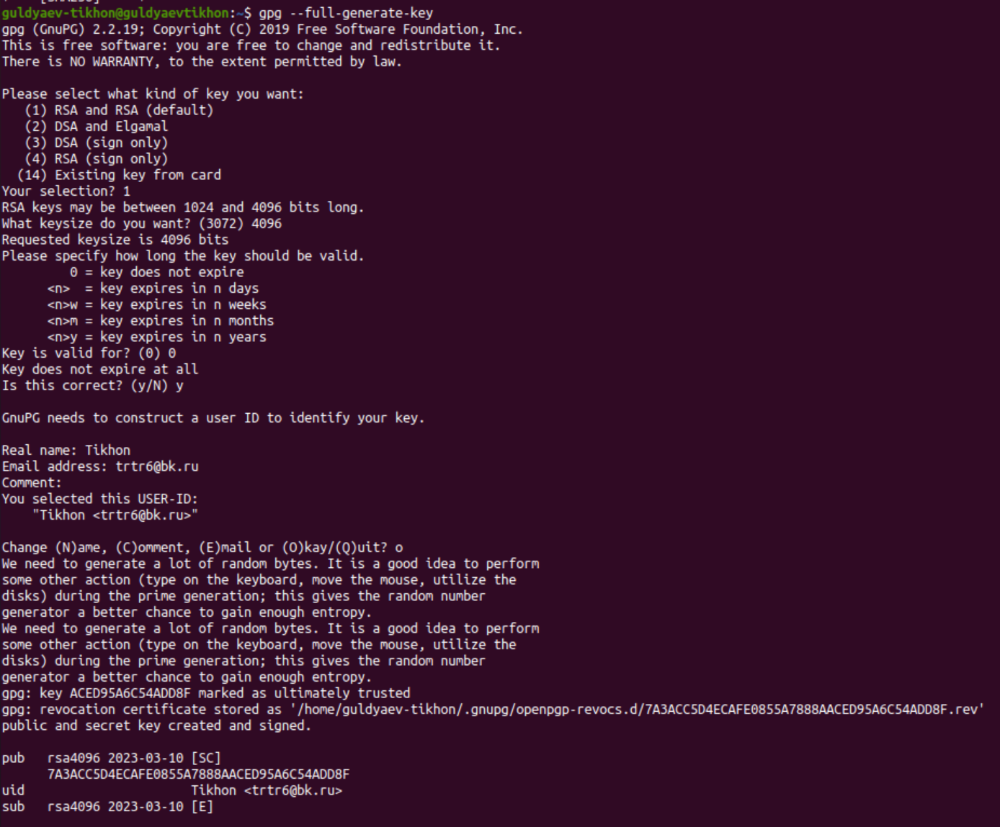
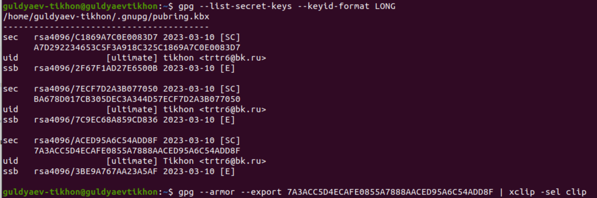
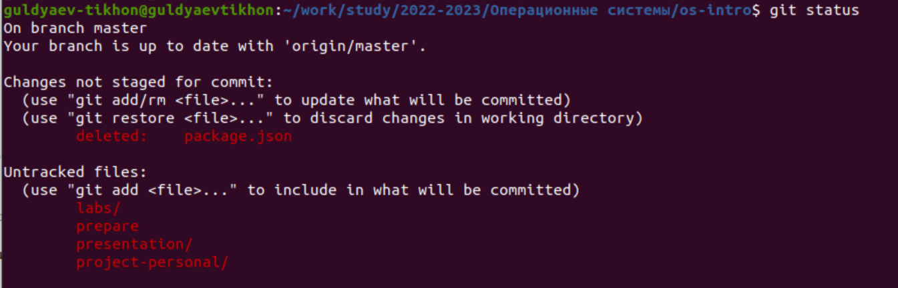
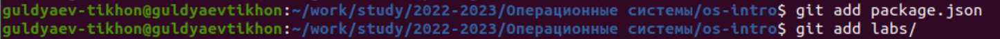
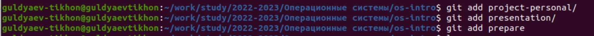
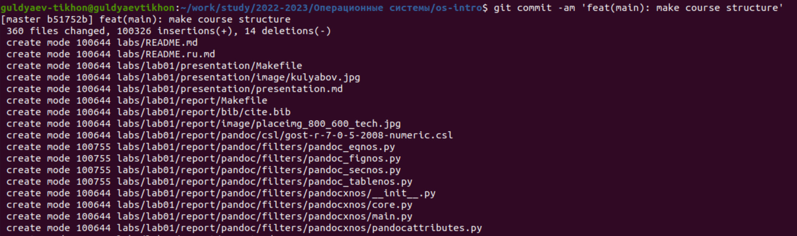
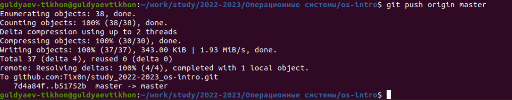

---
## Front matter
title: "Шаблон отчёта по лабораторной работе"
subtitle: "Простейший вариант"
author: "Гульдяев Тихон Дмитриевич"

## Generic otions
lang: ru-RU
toc-title: "Содержание"

## Bibliography
bibliography: bib/cite.bib
csl: pandoc/csl/gost-r-7-0-5-2008-numeric.csl

## Pdf output format
toc: true # Table of contents
toc-depth: 2
lof: true # List of figures
lot: true # List of tables
fontsize: 12pt
linestretch: 1.5
papersize: a4
documentclass: scrreprt
## I18n polyglossia
polyglossia-lang:
  name: russian
  options:
	- spelling=modern
	- babelshorthands=true
polyglossia-otherlangs:
  name: english
## I18n babel
babel-lang: russian
babel-otherlangs: english
## Fonts
mainfont: PT Serif
romanfont: PT Serif
sansfont: PT Sans
monofont: PT Mono
mainfontoptions: Ligatures=TeX
romanfontoptions: Ligatures=TeX
sansfontoptions: Ligatures=TeX,Scale=MatchLowercase
monofontoptions: Scale=MatchLowercase,Scale=0.9
## Biblatex
biblatex: true
biblio-style: "gost-numeric"
biblatexoptions:
  - parentracker=true
  - backend=biber
  - hyperref=auto
  - language=auto
  - autolang=other*
  - citestyle=gost-numeric
## Pandoc-crossref LaTeX customization
figureTitle: "Рис."
tableTitle: "Таблица"
listingTitle: "Листинг"
lofTitle: "Список иллюстраций"
lotTitle: "Список таблиц"
lolTitle: "Листинги"
## Misc options
indent: true
header-includes:
  - \usepackage{indentfirst}
  - \usepackage{float} # keep figures where there are in the text
  - \floatplacement{figure}{H} # keep figures where there are in the text
---

# Цель работы

– Изучить идеологию и применение средств контроля версий.

 – Освоить умения по работе с git.

# Задание

– Создать базовую конфигурацию для работы с git.

 – Создать ключ SSH. 

– Создать ключ PGP. 

– Настроить подписи git. 

– Зарегистрироваться на Github. 

– Создать локальный каталог для выполнения заданий по предмету.

# Теоретическое введение

Git - это распределенная система управления версиями, которая используется для отслеживания изменений в файловой системе и совместной работы над кодом.

Git позволяет программистам сохранять и отслеживать изменения в коде, создавать ветки для экспериментов с новым функционалом и слияния их с основной веткой после тестирования, а также отменять изменения в случае необходимости. Git также предоставляет возможность работать с удаленными репозиториями и совместно работать над проектами с другими разработчиками.

Git очень популярен среди разработчиков по всему миру и широко используется в индустрии разработки программного обеспечения.

Git-flow - это методология ведения разработки с использованием системы контроля версий Git. Она была разработана для упрощения и стандартизации процесса разработки и релизов программного обеспечения.

Git-flow определяет строгие правила для организации ветвления репозитория и определяет, каким образом происходит работа с различными ветками, которые используются в процессе разработки. Основные ветки в git-flow - это master, develop, feature, release и hotfix.

- Master - это ветка, которая содержит только стабильный код, который прошел полный цикл тестирования и готов для релиза.
- Develop - это ветка, на которой разрабатывается новый функционал и объединяются все изменения от feature-веток.
- Feature - это ветка, которая создается для работы над конкретной функцией или задачей.
- Release - это ветка, которая создается перед выпуском новой версии программного обеспечения и содержит исправления ошибок и подготовку к выпуску.
- Hotfix - это ветка, которая создается для исправления критических ошибок в выпущенной версии программного обеспечения.

Git-flow предлагает четкие правила и инструменты для совместной работы над проектами и позволяет упростить процесс разработки и управления версиями, что повышает эффективность работы команды разработчиков.

# Выполнение лабораторной работы

## Регистрация на github.com

Необходимо зарегистрироваться, делается весьма тривиальным способом, у меня уже был аккаунт и я буду его использовать.

## Установка git-flow

    sudo apt update
    sudo apt install git-flow

## Установка gh

    sudo snap install gh

##  Базовая настройка git

    git config --global user.name "Tikhon Guldyaev"
    git config --global user.email "trtr6@bk.ru"
    git config --global core.quotepath false
    git config --global init.defaultBranch master
    git config --global core.autocrlf input
    git config --global core.safecrlf warn

## Создание ssh ключа

    ssh-keygen -t rsa -b 4096
    ssh-keygen -t ed25519

Команда вывода ssh ключа что бы добавить его в https://github.com/settings/keys:

    cat .ssh/id_rsa.pub

## Создание pgp ключа

    gpg --full-generate-key

Из предложенных вариантов выбираем SA and RSA, вводим 4096, вводим 0, пишем имя и почту совпадающую с почтой при регистрации GitHub, комментарий оставляем пустым.

{#fig:001 width=70%}
create pgp

## Добавление PGP ключа в GitHub

    gpg --list-secret-keys --keyid-format LONG

ищем нужный ID ключа 

    gpg --armor --export <ID ключа> | xclip -sel clip

{#fig:002 width=70%}
pgp key

теперь ключ у нас в буфере обмена, осталось вставить его на странице https://github.com/settings/keys

## Настройка автоматических подписей коммитов git

    git config --global user.signingkey <ID ключа>
    git config --global commit.gpgsign true
    git config --global gpg.program $(which gpg2)

## Сознание репозитория курса на основе шаблона

    mkdir -p ~/work/study/2022-2023/"Операционные системы"
    cd ~/work/study/2022-2023/"Операционные системы"
    gh repo create study_2022-2023_os-intro
    	--template=yamadharma/course-directory-student-template --public
    mkdir os-intro
    git clone --recursive
    	git@github.com:<owner>/study_2021-2022_os-intro.git os-intro

## Настройка каталога курса

cd ~/work/study/2021-2022/"Операционные системы"/os-intro
rm package.json
make COURSE=os-intro

    cd ~/work/study/2021-2022/"Операционные системы"/os-intro
    rm package.json
    make COURSE=os-intro

И отправляем все наши изменения на сервер:

    git status

 {#fig:003 width=70%}

    git add <файлы которые были изменены или удалены>

{#fig:004 width=70%}

{#fig:005 width=70%}

    git commit -am 'feat(main): make course structure'

{#fig:006 width=70%}

    git push origin master

{#fig:007 width=70%}

# Контрольные вопросы

1. Что такое системы контроля версий (VCS) и для решения каких задач они предназначаются?

   Системы контроля версий (VCS) - это программное обеспечение, которое помогает управлять изменениями в исходном коде программного обеспечения и других файлов в рамках проекта. Они используются для отслеживания изменений, контроля версий и управления совместной работой над проектом.

   С помощью систем контроля версий можно выполнять следующие задачи:

   1. Управление версиями кода и файлов: VCS позволяют отслеживать изменения в исходном коде и файловой системе, что делает возможным возвращение к предыдущим версиям проекта или отслеживание изменений во времени.
   2. Совместная работа: VCS позволяют нескольким разработчикам работать над одним и тем же проектом одновременно, управлять конфликтами и синхронизировать изменения.
   3. Отслеживание изменений: VCS предоставляют подробную информацию о том, кто, когда и что изменил в коде или файле, что позволяет быстро находить ошибки и устранять их.
   4. Восстановление после сбоев: VCS предоставляют возможность восстановления данных после сбоев или потери данных.
   5. Ветвление и слияние: VCS позволяют создавать ветвления проекта, чтобы разработчики могли работать над различными функциональностями или исправлениями, и затем объединять изменения в основную ветвь проекта.

   Системы контроля версий широко используются в различных областях, включая программирование, научные исследования, дизайн, написание текстов, управление проектами и т.д.

2. Объясните следующие понятия VCS и их отношения: хранилище, commit, история, рабочая копия.
   Хранилище (repository) - это централизованное место, где хранится вся история изменений проекта и его файлов, а также все версии кода и файлов. Хранилище обычно расположено на сервере и доступно для совместной работы нескольких разработчиков.

   Commit (зафиксированные изменения) - это процесс сохранения изменений в файле или наборе файлов, которые были внесены в рабочую копию проекта. Коммит позволяет зафиксировать изменения в истории проекта, сохранить их и описать, какие изменения были внесены.

   История (history) - это список всех коммитов, выполненных в проекте. История позволяет отследить, кто и когда внес изменения в проект, а также посмотреть содержимое этих изменений.

   Рабочая копия (working copy) - это локальная копия проекта, которая находится на компьютере разработчика. Рабочая копия содержит текущую версию файлов проекта, которые разработчик редактирует и модифицирует, прежде чем выполнить коммит и отправить изменения в хранилище.

   В рамках VCS эти понятия взаимосвязаны следующим образом:

   - Разработчики получают рабочую копию проекта из хранилища на свой компьютер.
   - Они вносят изменения в файлы проекта в рабочей копии.
   - Когда разработчик закончил работу, он выполняет коммит, чтобы зафиксировать изменения в локальной истории и отправить их в хранилище.
   - Коммиты попадают в историю проекта, где они хранятся вместе со всей предыдущей историей изменений.

   Таким образом, VCS позволяют управлять версиями проекта, отслеживать изменения и совместно работать над проектом.

3. Что представляют собой и чем отличаются централизованные и децентрализованные VCS? Приведите примеры VCS каждого вида.

   Централизованные VCS (CVCS) - это системы контроля версий, в которых хранилище находится на центральном сервере, а разработчики получают локальные копии файлов с сервера и отправляют свои изменения на сервер. CVCS требуют постоянного подключения к серверу, чтобы получить доступ к файлам и функциональности VCS. Некоторые примеры CVCS: Subversion, Team Foundation Server, CVS.

   Децентрализованные VCS (DVCS) - это системы контроля версий, в которых каждый разработчик имеет локальную копию репозитория. Это означает, что каждый разработчик может работать независимо и сохранять изменения в своем локальном репозитории без необходимости подключения к центральному серверу. После этого изменения могут быть синхронизированы между локальными репозиториями и сервером. Некоторые примеры DVCS: Git, Mercurial, Bazaar.

   Основные различия между централизованными и децентрализованными VCS:

   - В CVCS хранилище находится на центральном сервере, в то время как в DVCS каждый разработчик имеет локальную копию репозитория.
   - В CVCS для выполнения большинства операций необходимо подключение к центральному серверу, в то время как в DVCS многие операции можно выполнить локально без доступа к серверу.
   - DVCS обеспечивают более гибкий и распределенный рабочий процесс, а CVCS обычно предоставляют более простой и предсказуемый рабочий процесс.

   Выбор между CVCS и DVCS зависит от многих факторов, таких как размер и сложность проекта, количество разработчиков, географическое расположение разработчиков и т.д.

   Примеры централизованных VCS:

   - Subversion (или SVN) - один из наиболее распространенных CVCS, который предоставляет простой и надежный способ управления версиями файлов и папок.
   - Team Foundation Server (TFS) - это CVCS, разработанный компанией Microsoft для использования в среде Microsoft Visual Studio и других средах разработки.

   Примеры децентрализованных VCS:

   - Git - наиболее популярная и широко используемая DVCS, созданная Линусом Торвальдсом для разработки ядра Linux. Git предоставляет широкий набор функций и поддерживает эффективную работу с большими проектами.
   - Mercurial (или Hg) - еще одна популярная DVCS, которая обладает простым и интуитивно понятным интерфейсом. Mercurial широко используется в индустрии и научных сообществах для управления различными проектами.
   - Bazaar - децентрализованная система контроля версий с поддержкой многих различных протоколов и платформ. Bazaar обладает гибкой системой ветвления и слияния и является отличным выбором для разработки open-source проектов.

4. Опишите действия с VCS при единоличной работе с хранилищем.

   Если вы работаете в VCS в одиночку, то вы можете использовать систему контроля версий для управления историей изменений вашего кода и резервного копирования вашего проекта. Ниже приведены основные шаги, которые вы можете выполнить при работе с VCS в одиночку:

   1. Создайте репозиторий: создайте новый репозиторий в VCS, который будет использоваться для управления историей изменений вашего кода.
   2. Создайте рабочую копию: создайте локальную копию репозитория на своем компьютере. Это называется рабочей копией, которая будет использоваться для работы над вашим проектом.
   3. Внесите изменения: внесите изменения в свой проект, например, добавьте новый файл или измените существующий файл. После внесения изменений выполните команду "commit", чтобы сохранить изменения в свой локальный репозиторий.
   4. Просмотрите историю изменений: используйте команду "log" для просмотра истории изменений вашего проекта. Вы можете просмотреть список изменений, включая комментарии к коммитам, даты и авторов изменений.
   5. Восстановление из резервной копии: в случае потери данных или сбоя вам может потребоваться восстановить проект из резервной копии. Вы можете использовать VCS, чтобы восстановить предыдущую версию вашего проекта.
   6. Работа с ветвями: в VCS вы можете создавать ветки, чтобы работать над различными версиями вашего проекта параллельно. Вы можете создать новую ветку и переключаться между ветками, используя команды "branch" и "checkout".
   7. Синхронизация с удаленным хранилищем: если вы хотите синхронизировать свой локальный репозиторий с удаленным хранилищем, то выполните команду "push" или "pull", чтобы отправить или получить изменения с сервера.

   Таким образом, при работе в VCS в одиночку вы можете использовать систему контроля версий для управления изменениями в вашем проекте и сохранения его истории.

5. Опишите порядок работы с общим хранилищем VCS.

   Работа с общим хранилищем VCS (также называемым централизованной системой контроля версий) включает несколько этапов, которые можно описать следующим образом:

   1. Создание репозитория: создайте общий репозиторий на сервере, который будет использоваться для хранения истории изменений проекта.
   2. Клонирование репозитория: каждый участник проекта должен склонировать репозиторий на свой локальный компьютер, чтобы получить локальную рабочую копию проекта.
   3. Работа с проектом: участники проекта могут работать с проектом, вносить изменения в файлы, создавать новые файлы и т.д.
   4. Сохранение изменений: после внесения изменений в проект, участники могут выполнить команду "commit", чтобы сохранить изменения в локальном репозитории.
   5. Обновление локального репозитория: если другой участник внес изменения в проект и отправил их в общий репозиторий, то каждый участник должен выполнить команду "pull" (или "fetch" и "merge") чтобы получить обновления в свой локальный репозиторий.
   6. Решение конфликтов: если несколько участников внесли изменения в один и тот же файл, возникает конфликт, который необходимо решить. Участники могут вручную решать конфликты, или же использовать специальные инструменты для автоматического разрешения конфликтов.
   7. Отправка изменений на сервер: после того, как участники разрешили все конфликты и внесли все необходимые изменения, они могут выполнить команду "push", чтобы отправить изменения в общий репозиторий.

   Таким образом, работа с общим хранилищем VCS позволяет участникам проекта работать над проектом одновременно, сохраняя историю изменений и резервную копию проекта на сервере. Однако, при работе с общим хранилищем необходимо быть внимательным и следить за изменениями, чтобы не возникли конфликты.

6. Каковы основные задачи, решаемые инструментальным средством git?

   Git - это система контроля версий, которая предоставляет набор инструментов для управления изменениями в проекте. Основные задачи, которые решает Git, включают в себя:

   1. Отслеживание изменений в проекте: Git позволяет отслеживать изменения в коде, документации, изображениях и других файловых форматах. Он сохраняет историю изменений, чтобы вы могли вернуться к предыдущим версиям проекта и откатить изменения, если это необходимо.
   2. Совместная работа над проектом: Git позволяет нескольким разработчикам работать над одним проектом одновременно, вносить изменения и объединять их в общий репозиторий.
   3. Управление конфликтами: Git предоставляет механизмы для решения конфликтов при слиянии изменений, которые были внесены разными разработчиками в один и тот же файл.
   4. Откат изменений: Git позволяет откатывать изменения, которые привели к ошибкам или проблемам в проекте.
   5. Ветвление проекта: Git позволяет создавать ветви проекта, которые позволяют изолировать изменения и разрабатывать новые функции без влияния на основную ветвь проекта.
   6. Резервное копирование проекта: Git предоставляет возможность создавать резервные копии проекта на удаленных серверах, что защищает проект от потери данных.

   Таким образом, Git предоставляет набор инструментов для управления изменениями в проекте, что позволяет разработчикам более эффективно работать над проектами в команде, управлять версиями проекта и защищать его от потерь данных.

7. Назовите и дайте краткую характеристику командам git.

   Git - это система контроля версий с открытым исходным кодом, которая предоставляет набор команд для управления проектом. Вот некоторые из наиболее часто используемых команд Git и их краткие описания:

   1. git init - создает новый репозиторий Git в выбранной директории
   2. git clone - клонирует существующий репозиторий Git на локальную машину
   3. git add - добавляет изменения в индекс (стейдж) для последующего коммита
   4. git commit - фиксирует изменения, добавленные в индекс, и создает новую версию репозитория
   5. git status - показывает статус файлов в рабочей копии и индексе
   6. git push - отправляет локальные изменения в удаленный репозиторий
   7. git pull - загружает изменения из удаленного репозитория на локальную машину
   8. git branch - создает новую ветку или показывает список имеющихся веток
   9. git merge - объединяет изменения из одной ветки в другую
   10. git log - показывает историю коммитов в репозитории
   11. git checkout - переключает между ветками или версиями файлов
   12. git stash - сохраняет изменения, которые не должны быть добавлены в репозиторий в данный момент, но которые нужно сохранить для будущего использования.

   Это далеко не полный список команд Git, но эти команды являются основными и наиболее часто используемыми. Их понимание и использование помогает разработчикам эффективно управлять проектами в системе контроля версий Git.

8. Приведите примеры использования при работе с локальным и удалённым репозиториями.

   Пример использования Git при работе с локальным репозиторием:

   1. Создание нового репозитория: git init
   2. Добавление файлов в индекс: git add filename
   3. Создание коммита: git commit -m "Commit message"
   4. Просмотр истории коммитов: git log
   5. Создание новой ветки: git branch new-branch
   6. Переключение на другую ветку: git checkout branch-name

   Пример использования Git при работе с удаленным репозиторием:

   1. Клонирование удаленного репозитория на локальный компьютер: git clone remote-url local-directory
   2. Добавление удаленного репозитория в список удаленных репозиториев: git remote add origin remote-url
   3. Отправка изменений на удаленный репозиторий: git push origin branch-name
   4. Получение изменений с удаленного репозитория: git pull origin branch-name

   Также возможно использование Git для совместной работы над проектом, когда несколько разработчиков работают над одним и тем же репозиторием. В этом случае они могут использовать команды git push и git pull для синхронизации своих изменений с общим удаленным репозиторием.

9. Что такое и зачем могут быть нужны ветви (branches)?

   Ветви (branches) в Git - это легковесные указатели на коммиты в истории репозитория, которые образуют древовидную структуру ветвления разработки. Каждая ветвь представляет собой отдельную линию разработки, которая может развиваться независимо от других ветвей.

   Ветви могут быть нужны по нескольким причинам:

   - Разработка новой функциональности: ветка может быть создана для разработки новой функциональности или исправления ошибок. Разработчик может работать в этой ветке, не затрагивая основную линию разработки, пока его изменения не будут готовы для включения в основную ветку.
   - Релизы: ветки могут быть созданы для подготовки к выпуску новых версий программного обеспечения. В этом случае ветка создается на основе стабильной версии программы, и в нее могут быть включены только исправления ошибок и другие изменения, которые не нарушают стабильность программы.
   - Работа нескольких разработчиков: если несколько разработчиков работают над одним проектом, они могут создавать ветки для своей работы, а затем сливать свои изменения с основной веткой.

   Использование ветвей позволяет избежать конфликтов между изменениями разных разработчиков, упрощает управление изменениями и повышает безопасность разработки, так как изменения не вносятся непосредственно в основную ветку, пока они не будут полностью протестированы и подготовлены к включению в основную ветку.

10. Как и зачем можно игнорировать некоторые файлы при commit?

    В Git можно игнорировать некоторые файлы при коммите, чтобы они не попадали в репозиторий и не отображались в истории изменений. Для этого используется файл .gitignore, который содержит список игнорируемых файлов и папок.

    Список игнорируемых файлов и папок указывается в файле .gitignore, который должен располагаться в корневой директории репозитория. В этом файле можно указать шаблоны имен файлов и папок, которые нужно игнорировать при коммите.

    При выполнении команды git status файлы, указанные в .gitignore, будут отмечены как игнорируемые и не будут показаны в списке измененных файлов. Однако, если файл уже был добавлен в репозиторий до добавления его в .gitignore, он все равно будет отображаться в истории изменений.

    Игнорирование ненужных файлов при коммите позволяет сократить размер репозитория, ускорить операции с Git и избежать случайного добавления конфиденциальных данных или временных файлов.

# Выводы

Я изучил идеологию и применение средств контроля версий и освоил умения по работе с git.

# Список литературы{.unnumbered}

::: {#refs}

https://www.google.ru

https://chat.openai.com/chat

:::
