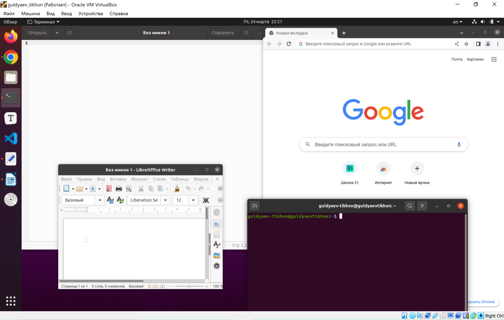

---
## Front matter
title: "Операционные системы"
subtitle: "Лабароторная работа №4"
author: "Гульдяев Тихон Дмитриевич"

## Generic otions
lang: ru-RU
toc-title: "Содержание"

## Bibliography
bibliography: bib/cite.bib
csl: pandoc/csl/gost-r-7-0-5-2008-numeric.csl

## Pdf output format
toc: true # Table of contents
toc-depth: 2
lof: true # List of figures
lot: true # List of tables
fontsize: 12pt
linestretch: 1.5
papersize: a4
documentclass: scrreprt
## I18n polyglossia
polyglossia-lang:
  name: russian
  options:
	- spelling=modern
	- babelshorthands=true
polyglossia-otherlangs:
  name: english
## I18n babel
babel-lang: russian
babel-otherlangs: english
## Fonts
mainfont: PT Serif
romanfont: PT Serif
sansfont: PT Sans
monofont: PT Mono
mainfontoptions: Ligatures=TeX
romanfontoptions: Ligatures=TeX
sansfontoptions: Ligatures=TeX,Scale=MatchLowercase
monofontoptions: Scale=MatchLowercase,Scale=0.9
## Biblatex
biblatex: true
biblio-style: "gost-numeric"
biblatexoptions:
  - parentracker=true
  - backend=biber
  - hyperref=auto
  - language=auto
  - autolang=other*
  - citestyle=gost-numeric
## Pandoc-crossref LaTeX customization
figureTitle: "Рис."
tableTitle: "Таблица"
listingTitle: "Листинг"
lofTitle: "Список иллюстраций"
lotTitle: "Список таблиц"
lolTitle: "Листинги"
## Misc options
indent: true
header-includes:
  - \usepackage{indentfirst}
  - \usepackage{float} # keep figures where there are in the text
  - \floatplacement{figure}{H} # keep figures where there are in the text
---

# Цель работы

Познакомиться с операционной системой Linux, получить практические навыки рабо-
ты с консолью и некоторыми графическими менеджерами рабочих столов операционной
системы.

# Выполнение лабораторной работы

 Запускаем машину (рис. @fig:001).

{#fig:001 width=70%}

Перехожу на текстовую консоль сочетанием клавиш ctrl+alt+f3 (рис. @fig:002).

Сколько текстовых консолей доступно на вашем компьютере? Всего доступно 5 текстовых консолей, первая "занята" графическим интерфейсом, но там мы можем запустить терминал

{#fig:002 width=70%}

Перемещаюсь между текстовыми консолями с помощью сочетаний клавиш ctrl+atl+f<номер 2-5>. 

Вот пример переключения на третью по счету консоль (рис. @fig:003).

{#fig:003 width=70%}

Логинюсь в текстовой консоли операционный системы используя логин своей учетный записи(символы при вводе пароля не отображаются это сделано для безопасности) (рис. @fig:004).

{#fig:004 width=70%}

Завершаю консольный сеанс командой exit (рис. @fig:005).

Также существует команда logout и shutdown -h now, а также сочетание клавиш сtrl+D

{#fig:005 width=70%}

Переключаюсь на графический интерфейс сочетанием клавиш ctrl+alt+f1 (рис. @fig:006).

{#fig:006 width=70%}

Менеджер рабочих столов, запускаемый по умолчанию называется GNOME Shell.

Устанавливаю менеджеры рабочих столов KDE, XFCE и оконный менеджер Openbox.

Следующими командами:

    sudo apt-get install kde-plasma-desktop
    sudo apt-get install xfce4
    sudo apt-get install openbox

Перезапускаю машину и выбираю необходимый при логине (рис. @fig:007).

{#fig:007 width=70%}

KDE (рис. @fig:008).

{#fig:008 width=70%}

XFCE (рис. @fig:009).

{#fig:009 width=70%}

Openbox (рис. @fig:010).

{#fig:010 width=70%}

На компьютере установлены следующие графические менеджеры: GNOME Shell, Wayland, KDE, Xfce, Openbox.

Изучил список установленных программ, вот наиболее используемые (рис. @fig:011).

{#fig:011 width=70%}

Запускаю браузер под названием "Google Chrome", текстовой редактор под названием "Текстовый редактор", текстовой процессор под названием "LibreOffice Writer", эмулятор консоли под названием "Терминал" (рис. @fig:012).

{#fig:012 width=70%}

# Выводы

Я познакомился с операционной системой Linux, получил практические навыки работы с консолью и некоторыми графическими менеджерами рабочих столов операционной
системы.

# Ответы на контрольные вопросы

1. Что такое компьютерный терминал? Есть ли, по вашему мнению, у него преимущества перед графическим интерфейсом?

   Компьютерный терминал - это устройство, которое используется для ввода и вывода данных на компьютер. Обычно терминал состоит из клавиатуры и монитора, но также может включать в себя другие устройства ввода и вывода, такие как мышь, сканер или принтер.

   В отличие от графического интерфейса, который предоставляет пользователю графическое представление информации, компьютерный терминал работает через командную строку, где пользователь вводит команды в виде текста. Такой подход может иметь свои преимущества, в том числе:

   1. Скорость работы: терминалы могут обрабатывать и выводить информацию быстрее, чем графические интерфейсы, что может быть важно для некоторых приложений, например, для работы с большими объемами данных.
   2. Гибкость: использование терминала может быть более гибким, поскольку позволяет пользователю выполнять любые задачи с помощью командной строки, а не ограничиваться ограничениями, накладываемыми графическим интерфейсом.
   3. Надежность: терминалы могут быть более надежными, чем графические интерфейсы, так как не требуют высокой производительности графической подсистемы.

   Однако использование терминала также имеет свои недостатки, включая отсутствие графической информации, которую многие пользователи считают более интуитивной, а также сложность использования для тех, кто не знаком с командной строкой.

   В целом, преимущества использования терминала или графического интерфейса зависят от конкретной ситуации и предпочтений пользователя. Некоторые задачи могут лучше выполняться с помощью терминала, а другие - с помощью графического интерфейса.

2. Что такое входное имя пользователя?

   Входное имя пользователя (англ. username или login name) — это уникальный идентификатор, который используется для аутентификации пользователя в компьютерной системе, сети или веб-сервисе. Обычно это текстовая строка, которую пользователь вводит при входе в систему, в паре с паролем.

   Имя пользователя может быть любым уникальным идентификатором, однако в большинстве случаев оно состоит из букв, цифр и символов подчеркивания. В некоторых системах имя пользователя может быть также связано с электронной почтой или номером телефона.

   Имя пользователя используется для идентификации пользователя при работе с файлами, папками и другими ресурсами, которые он может получить доступ, а также для отслеживания и аудита действий пользователя в системе.

3. В каком файле хранятся пароли пользователей? В каком виде они хранятся?

   В Linux пароли пользователей хранятся в файле /etc/shadow. Этот файл доступен только для чтения root-пользователю, чтобы предотвратить несанкционированный доступ к хэшам паролей пользователей.

   Файл /etc/shadow содержит записи для каждого пользователя системы, каждая запись содержит следующие поля, разделенные символом ":" :

   - Имя пользователя (логин)
   - Хеш пароля (зашифрованный пароль)
   - Дата последнего изменения пароля
   - Минимальное и максимальное количество дней до смены пароля
   - Количество дней, прошедших с момента последней смены пароля
   - Количество дней до истечения срока действия пароля
   - Количество дней до предупреждения о необходимости смены пароля
   - Зарезервированное поле

   Хеш пароля сохраняется в файле /etc/shadow в зашифрованном виде с помощью одной из криптографических хеш-функций, таких как SHA-256 или SHA-512. Это означает, что фактический пароль пользователя не хранится в явном виде, и вместо этого при аутентификации вводимый пользователем пароль сравнивается с сохраненным хешем пароля. Если хеши совпадают, то пользователь получает доступ к системе.

4. Где хранятся настройки пользовательских программ?

   Настройки пользовательских программ в Linux могут храниться в разных местах в зависимости от программы и дистрибутива Linux. Однако, есть несколько распространенных мест, где обычно хранятся настройки пользовательских программ:

   1. Домашняя директория пользователя: многие программы хранят свои настройки в подкаталоге скрытой директории пользователя в его домашней директории. Например, для программы Firefox настройки хранятся в каталоге "~/.mozilla/firefox/".
   2. /etc/: некоторые программы могут хранить свои настройки в системных файлах конфигурации в каталоге "/etc/". Например, настройки сетевых интерфейсов хранятся в файле "/etc/network/interfaces".
   3. /usr/local/: пользовательские программы, которые не являются частью дистрибутива Linux, могут устанавливаться в каталог "/usr/local/", и настройки могут храниться в соответствующих подкаталогах.
   4. /var/: некоторые программы могут создавать и использовать файлы данных или журналы в каталоге "/var/", также настройки могут храниться в соответствующих подкаталогах.

   Общее правило, что большинство программ позволяют изменять расположение файла конфигурации, например, через опцию командной строки или переменную окружения. Если вы не можете найти файл настроек для определенной программы, рекомендуется прочитать документацию или обратиться к сообществу Linux для получения помощи.

5. Какое входное имя у администратора ОС Unix?

   Входное имя (логин) администратора в ОС Unix обычно является "root". Это специальный учетная запись с наивысшими привилегиями на системе, которая имеет полный доступ ко всему компьютеру и может выполнять любые операции. Войти в систему под учетной записью root может только пользователь с правами администратора или сам root.

6. Имеет ли администратор доступ к настройкам пользователей?

   Да, администратор ОС имеет доступ к настройкам пользователей. Администратор может создавать, удалять и редактировать учетные записи пользователей, устанавливать права доступа, изменять пароли и другие параметры учетных записей. Также администратор может просматривать файлы пользователей и выполнять другие действия, которые требуют прав администратора.

   Однако, следует отметить, что доступ администратора к данным пользователей может быть ограничен политиками безопасности или другими мерами защиты данных. В таких случаях администратор может получить доступ к данным пользователей только при наличии соответствующих разрешений и авторизаций.

7. Каковы основные характеристики многопользовательской модели разграничения
  доступа

  Многопользовательская модель разграничения доступа - это система безопасности, которая позволяет нескольким пользователям работать на одном компьютере, сохраняя при этом приватность данных и разграничивая права доступа между пользователями. Основные характеристики этой модели включают:

  1. Аутентификация: каждый пользователь должен пройти процедуру аутентификации, чтобы получить доступ к системе. Аутентификация может осуществляться с помощью пароля, удостоверения личности или других методов.
  2. Авторизация: каждый пользователь получает определенные права доступа к системе и ее ресурсам, которые определяются системным администратором. Права доступа могут быть ограничены или расширены в зависимости от требований безопасности и потребностей пользователя.
  3. Разграничение доступа: каждый пользователь имеет доступ только к своим собственным файлам и папкам, а также к ресурсам, к которым ему предоставлено разрешение. Это помогает избежать случайного или намеренного удаления, изменения или просмотра файлов других пользователей.
  4. Аудит: система может отслеживать действия пользователей, чтобы обнаружить и предотвратить несанкционированный доступ или использование ресурсов. Это может включать запись журналов событий, проверку безопасности и другие меры.
  5. Управление ресурсами: системный администратор может контролировать и управлять ресурсами системы, такими как память, процессорное время и пропускную способность сети, чтобы предотвратить перегрузку и обеспечить эффективное использование ресурсов.

  В целом, многопользовательская модель разграничения доступа является основой для обеспечения безопасности и конфиденциальности данных в многопользовательских средах.

8. Какую информацию кроме пароля и логина содержит учётная запись пользователя?

   Учетная запись пользователя в операционной системе содержит множество другой информации, помимо логина и пароля. Некоторые из основных атрибутов учетной записи пользователя, которые могут храниться в системе, включают в себя:

   1. Имя пользователя (username): это уникальное имя, которое используется для идентификации пользователя в системе.
   2. Домашняя директория (home directory): это каталог на файловой системе, который назначается пользователю в качестве домашнего каталога, где он может сохранять свои файлы.
   3. Идентификатор пользователя (user ID): это уникальный числовой идентификатор, который используется для идентификации пользователя в системе. Каждый пользователь в системе имеет свой уникальный идентификатор пользователя.
   4. Группа пользователя (user group): это группа пользователей, к которой относится учетная запись пользователя. Группы позволяют обеспечивать доступ к файлам и ресурсам на основе прав доступа, связанных с группой.
   5. Полномочия пользователя (user permissions): это права доступа, которые у пользователя есть к файлам и каталогам на файловой системе. Полномочия пользователя могут быть ограничены или расширены администратором системы.
   6. Шелл пользователя (user shell): это программа, которая используется пользователем для взаимодействия с операционной системой. Шелл обеспечивает пользователю доступ к командной строке, где он может выполнять различные команды и приложения.
   7. Дополнительные атрибуты пользователя: могут включать в себя адрес электронной почты, дату создания учетной записи, дату последней смены пароля, и т.д.

   В целом, информация, связанная с учетной записью пользователя, предоставляет системе необходимую информацию для управления доступом пользователя к ресурсам на системе и для обеспечения безопасности системы в целом.

9. Что такое UID и GID? Расшифруйте эти аббревиатуры.

   UID и GID - это числовые идентификаторы, которые используются в операционных системах для идентификации пользователей и групп пользователей.

   UID расшифровывается как "User ID" (идентификатор пользователя) и является уникальным числовым идентификатором, который присваивается каждому пользователю в системе. Каждый пользователь в системе имеет свой уникальный UID, который используется системой для идентификации пользователя и определения его прав доступа к ресурсам системы.

   GID расшифровывается как "Group ID" (идентификатор группы) и является числовым идентификатором, который присваивается группе пользователей в системе. Группа пользователей - это набор пользователей, которые имеют общие права доступа к определенным ресурсам на системе. Каждая группа пользователей в системе имеет свой уникальный GID, который используется системой для определения прав доступа группы к ресурсам системы.

   UID и GID являются важными атрибутами учетной записи пользователя в системе, которые используются для обеспечения безопасности системы и управления доступом пользователя к ресурсам на системе. Например, система может использовать UID и GID, чтобы определить, какие файлы и каталоги могут быть прочитаны или записаны пользователем, и какие команды и приложения могут быть запущены им.

10. Что такое GECOS?

    GECOS - это строка, которая содержит информацию о пользователе в операционной системе Unix и Unix-подобных системах. Эта строка может содержать информацию, такую как полное имя пользователя, адрес электронной почты, телефонный номер, должность и т.д.

    Аббревиатура GECOS происходит от первых букв информационных полей, которые она содержала в своем первоначальном использовании: "General Electric Comprehensive Operating System". Она была разработана в 1960-х годах и включала информацию о пользователе в системе.

    Сегодня, GECOS-строка содержит информацию о пользователе в /etc/passwd, файле, который хранит информацию о всех учетных записях пользователей в системе Unix. В некоторых системах эта строка также может использоваться для хранения дополнительной информации, такой как домашний адрес пользователя или номер его паспорта.

    Хотя большинство операционных систем уже не используют аббревиатуру GECOS, термин все еще используется для обозначения этой строки в файле /etc/passwd.

11. Что такое домашний каталог? Какие файлы хранятся в нем?

    Домашний каталог - это основной каталог, который предназначен для хранения пользовательских файлов в операционной системе Unix и Unix-подобных системах. Каждый пользователь в системе имеет свой собственный домашний каталог, который является базовым каталогом для всех файлов и папок, связанных с его учетной записью.

    Обычно, домашний каталог имеет путь /home/имя_пользователя (в случае Linux и многих других Unix-подобных систем). В этом каталоге обычно хранятся все пользовательские файлы, такие как документы, музыка, видео, изображения, конфигурационные файлы и т.д. Домашний каталог также может содержать скрытые файлы и папки, которые начинаются с точки (например, .bashrc), и которые используются для хранения настроек пользовательских программ.

    Некоторые из основных файлов, которые обычно хранятся в домашнем каталоге пользователя:

    - .bashrc - файл настроек командного интерпретатора Bash, который выполняется при входе пользователя в систему;
    - .bash_history - файл, который хранит историю введенных пользователем команд в командной строке;
    - .profile - файл, который содержит настройки среды пользователя, такие как переменные окружения;
    - .ssh - папка, которая содержит ключи для удаленного доступа по протоколу SSH.

    Также в домашнем каталоге могут храниться файлы и папки, созданные пользователем, для его собственных нужд, и которые могут быть различны в зависимости от конкретного пользователя.

12. Как называется ваш домашний каталог?

    "guldyaev-tikhon"

13. Имеет ли администратор возможность изменить содержимое домашнего каталога
    пользователя?

    Да, администратор имеет возможность изменять содержимое домашнего каталога любого пользователя в операционной системе Linux или Unix. Так как администратор имеет полные права на систему, он может изменять, копировать, перемещать или удалять файлы и папки в любом каталоге, включая домашний каталог пользователя.

    Однако, стандартно администраторы не должны изменять содержимое домашнего каталога пользователей без их явного согласия. Домашний каталог содержит личные файлы и настройки пользователя, и изменение его содержимого без явного разрешения пользователя может привести к непредвиденным последствиям.

    В целях безопасности, администраторы могут использовать специальные политики и ограничения доступа для управления доступом к домашним каталогам пользователей. Также могут быть использованы инструменты для создания резервных копий и восстановления файлов пользователей, чтобы предотвратить потерю данных в случае ошибки или сбоя в системе.

14. Что хранится в файле /etc/passwd?

    Файл /etc/passwd - это текстовый файл, который содержит информацию о пользовательских учетных записях в операционной системе Linux или Unix. В каждой строке файла /etc/passwd содержится информация об одном пользователе.

    Каждая строка файла /etc/passwd имеет следующий формат:

        username:password:UID:GID:GECOS:home_directory:login_shell

    Где:

    - username - имя пользователя;
    - password - пароль пользователя (обычно в файле /etc/shadow);
    - UID - идентификатор пользователя;
    - GID - идентификатор основной группы пользователя;
    - GECOS - поле для произвольной информации об учетной записи пользователя, такой как полное имя, телефон, адрес и т.д.;
    - home_directory - домашний каталог пользователя;
    - login_shell - оболочка по умолчанию для пользователя.

    Файл /etc/passwd используется системой для проверки аутентификации и авторизации пользователей при входе в систему. Однако, на современных системах обычно используется файл /etc/shadow для хранения паролей пользователей в зашифрованном виде. Файл /etc/passwd также может использоваться для задания настроек по умолчанию для новых пользователей и для других системных задач.

15. Как, просмотрев содержимое файла /etc/passwd, узнать, какие пользователи не
    смогут войти в систему?

    Для того, чтобы узнать, какие пользователи не смогут войти в систему, нужно просмотреть содержимое файла /etc/passwd и проверить наличие оболочки (login shell) у каждой учетной записи пользователя. Если учетная запись пользователя имеет /sbin/nologin или /usr/sbin/nologin в качестве оболочки, то пользователь не сможет войти в систему через оболочку.

    Оболочка /sbin/nologin или /usr/sbin/nologin используется для предотвращения входа пользователя в систему, но позволяет ему использовать удаленный доступ (например, ssh) для выполнения определенных задач, если это необходимо.

    Для просмотра содержимого файла /etc/passwd можно воспользоваться командой cat /etc/passwd или less /etc/passwd. Затем можно использовать фильтрацию строк, например, с помощью команды grep, чтобы найти пользователей без оболочки:

        cat /etc/passwd | grep nologin

    или

        less /etc/passwd
        /\/sbin\/nologin

    Это выведет список пользователей с /sbin/nologin или /usr/sbin/nologin в качестве оболочки, которые не смогут войти в систему через оболочку.

16. Что такое виртуальные консоли? Как вы думаете, что означает слово «виртуальный»
    в данном контексте?

    Виртуальные консоли - это возможность использования нескольких независимых экранов и клавиатур на одном физическом компьютере в операционной системе Linux. В Linux доступно несколько виртуальных консолей (обычно от 1 до 6 или больше), каждая из которых представляет собой отдельную текстовую консоль с собственным приглашением командной строки, на которой можно вводить команды и выполнять задачи.

    Каждая виртуальная консоль работает независимо от других и может быть использована для выполнения различных задач, например, для запуска различных приложений, работы в различных терминалах и т.д. Пользователь может переключаться между виртуальными консолями, используя сочетания клавиш на клавиатуре.

    Слово "виртуальный" в данном контексте означает, что это не настоящие физические консоли, а логические, которые создаются на основе одного физического устройства (монитора, клавиатуры и мыши). Таким образом, виртуальные консоли предоставляют пользователю удобный и гибкий способ управления системой, позволяя использовать несколько окон и выполнить несколько задач одновременно, не покидая текущую сессию.

17. Зачем нужна программа getty?

    Программа getty (get tty) - это программа, которая управляет текстовыми терминалами и виртуальными консолями в операционной системе Linux. Когда пользователь входит в систему через текстовый терминал или виртуальную консоль, getty обеспечивает авторизацию пользователя, запрашивая его логин и пароль.

    После успешной авторизации, getty запускает командный интерпретатор shell для пользователя, который может начать работу в системе. Если же авторизация не прошла успешно, getty возвращается к запросу логина и пароля, предоставляя еще один шанс для авторизации.

    Таким образом, программа getty обеспечивает безопасность системы, предотвращая несанкционированный доступ к системе и защищая данные пользователя. Она также обеспечивает управление ресурсами системы, предоставляя доступ к терминалам и консолям только тем пользователям, которые имеют на это права.

18. Что такое сеанс работы?

    Сеанс работы (session) - это период времени, в течение которого пользователь находится в системе и взаимодействует с ее ресурсами. Сеанс работы начинается с момента, когда пользователь входит в систему, и заканчивается, когда он выходит из нее или происходит отключение от системы по какой-либо причине.

    Во время сеанса работы пользователь может выполнять различные задачи, работать с файлами, запускать приложения, взаимодействовать с другими пользователями и т.д. При этом все действия пользователя отслеживаются системой и сохраняются в его профиле.

    Сеанс работы может быть как локальным (в случае, когда пользователь находится непосредственно за компьютером), так и удаленным (в случае, когда пользователь подключается к системе через сеть). В любом случае, система предоставляет пользователю доступ к ее ресурсам и обеспечивает безопасность его действий.

19. Что такое тулкит?

    Тулкит (toolkit) - это набор программных инструментов и библиотек, предназначенных для разработки приложений с графическим интерфейсом (GUI). Тулкит содержит набор графических элементов (кнопки, текстовые поля, меню и т.д.), а также средства для их стилизации и расположения на экране. Тулкиты облегчают процесс разработки приложений, так как предоставляют программистам готовые инструменты и функции для работы с графическим интерфейсом.

    Тулкиты могут быть написаны на разных языках программирования и работать с разными операционными системами. Некоторые из наиболее популярных тулкитов для разработки приложений с графическим интерфейсом включают Qt, GTK, wxWidgets и Tk. Они широко используются для создания приложений, таких как редакторы текста, графические редакторы, интернет-браузеры и многие другие.

20. Какие основные тулкиты существуют в системе Unix?

    Существует множество тулкитов (toolkits) для разработки графических приложений в системах Unix, но наиболее популярные из них - это:

    1. Qt - кроссплатформенный тулкит, написанный на языке C++, используемый в качестве основного фреймворка для создания графических приложений в операционных системах Linux, macOS, Windows и других.
    2. GTK - тулкит для разработки графических приложений на языках C, C++, Python, Perl и других, используется в операционных системах Linux и других Unix-подобных системах.
    3. Xlib - библиотека для работы с X-сервером, основой для многих графических тулкитов и оконных менеджеров в Unix-системах.
    4. Motif - тулкит, используемый для создания графических приложений в Unix-системах.
    5. Tk - кроссплатформенный тулкит, написанный на языке Tcl/Tk, используется для создания графических приложений в Unix-системах и других операционных системах.

    Каждый из этих тулкитов имеет свои особенности и преимущества, и выбор того или иного зависит от конкретных потребностей разработчика и его предпочтений.

# Список литературы{.unnumbered}

::: {#refs}

https://www.google.ru

https://chat.openai.com/chat

:::
