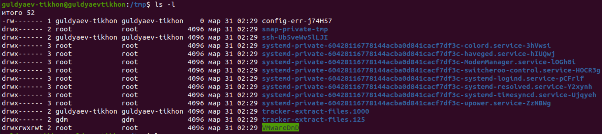
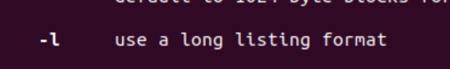

---
## Front matter
title: "Операционные системы"
subtitle: "Лабароторная работа №5"
author: "Гульдяев Тихон Дмитриевич"

## Generic otions
lang: ru-RU
toc-title: "Содержание"

## Bibliography
bibliography: bib/cite.bib
csl: pandoc/csl/gost-r-7-0-5-2008-numeric.csl

## Pdf output format
toc: true # Table of contents
toc-depth: 2
lof: true # List of figures
lot: true # List of tables
fontsize: 12pt
linestretch: 1.5
papersize: a4
documentclass: scrreprt
## I18n polyglossia
polyglossia-lang:
  name: russian
  options:
	- spelling=modern
	- babelshorthands=true
polyglossia-otherlangs:
  name: english
## I18n babel
babel-lang: russian
babel-otherlangs: english
## Fonts
mainfont: PT Serif
romanfont: PT Serif
sansfont: PT Sans
monofont: PT Mono
mainfontoptions: Ligatures=TeX
romanfontoptions: Ligatures=TeX
sansfontoptions: Ligatures=TeX,Scale=MatchLowercase
monofontoptions: Scale=MatchLowercase,Scale=0.9
## Biblatex
biblatex: true
biblio-style: "gost-numeric"
biblatexoptions:
  - parentracker=true
  - backend=biber
  - hyperref=auto
  - language=auto
  - autolang=other*
  - citestyle=gost-numeric
## Pandoc-crossref LaTeX customization
figureTitle: "Рис."
tableTitle: "Таблица"
listingTitle: "Листинг"
lofTitle: "Список иллюстраций"
lotTitle: "Список таблиц"
lolTitle: "Листинги"
## Misc options
indent: true
header-includes:
  - \usepackage{indentfirst}
  - \usepackage{float} # keep figures where there are in the text
  - \floatplacement{figure}{H} # keep figures where there are in the text
---

# Цель работы

Приобретение практических навыков взаимодействия пользователя с системой посредством командной строки.

# Выполнение лабораторной работы

Определяю полное имя моего домашнего каталога. (рис. @fig:001).

{#fig:001 width=70%}

Перехожу в каталог /tmp. (рис. @fig:002).

{#fig:002 width=70%}

Вывожу на экран содержимое каталога /tmp.(рис. @fig:003).

{#fig:003 width=70%}

Опция -l позволяет вывести содержимое в формате списка.(рис. @fig:004).

{#fig:004 width=70%}

Опция -a выводит скрытые файлы и каталоги.(рис. @fig:005).

{#fig:005 width=70%}

В каталоге /var/spoon/ есть подкаталог с именем cron (рис. @fig:006).

{#fig:006 width=70%}

Перехожу в домашний каталог и вывожу на экран содержимое каталога /var/spool/cron/ и каталога /var/spool/  (рис. @fig:007).

{#fig:007 width=70%}

Определяю, кто является владельцем файлов и подкаталогов в var/spool/ и var/spool/cron/ (рис. @fig:008).

{#fig:008 width=70%}

Создаю каталог с именем newdir (рис. @fig:009).

{#fig:009 width=70%}

В каталоге ~/newdir создаю новый каталог с именем morefun. (рис. @fig:010).

{#fig:010 width=70%}

В домашнем каталоге создаю одной командой три новых каталога с именами letters, memos, misk.(рис. @fig:011).

{#fig:011 width=70%}

Удаляю эти каталоги одной командой. (рис. @fig:012).

{#fig:012 width=70%}

Пробую удалить newdir командой rm и проверяю это.(рис. @fig:013). Безуспешно, ибо без дополнительных флагов команда rm для удаления директорий не подходит

{#fig:013 width=70%}

Удаляю эти каталог morefun командой rmdir и проверяю это. (рис. @fig:014).

{#fig:014 width=70%}

С помощью команды man определяю, какую опцию команды ls нужно использовать для просмотра содержимое не только указанного каталога, но и подкаталогов, входящих в него. (рис. @fig:015).

{#fig:015 width=70%}

С помощью команды man определяю набор опций команды ls, позволяющий отсортировать по времени последнего изменения выводимый список содержимого каталога с развёрнутым описанием файлов. (рис. @fig:016) и (рис. @fig:017) Это флаги -l и -t, пример команды: ls -tl

{#fig:016 width=70%}

{#fig:017 width=70%}

Используя команду man для просмотра описания следующих команд: cd, pwd, mkdir, rmdir, rm.

Команда cd не имеет своей man-страницы, поскольку она является встроенной командой оболочки (shell built-in), а не отдельным исполняемым файлом. Вместо этого можно прочитать информацию о команде cd с помощью команды help cd в терминале. (рис. @fig:018).

Команда cd используется для смены текущего рабочего каталога в терминале.

- -L: По умолчанию команда cd следует символическим ссылкам. Опция -L указывает на то, что нужно следовать физическому пути (ссылки не разыменовываются).
- -P: Опция -P указывает на то, что нужно следовать логическому пути, то есть разыменовывать символические ссылки и следовать по физическому пути.
- -e: Опция -e позволяет использовать команду cd с переменными окружения. В этом случае переменная HOME используется как каталог назначения, если заданный каталог не существует.
- -@: Опция -@ используется для показа атрибутов расширенных атрибутов файла или директории в терминале macOS. В Linux эта опция может отображать количество жестких ссылок на файл или директорию.

{#fig:018 width=70%}

Команда man pwd.(рис. @fig:019).

Команда pwd используется для вывода текущего рабочего каталога в терминале.

- -L – показывает символические ссылки в пути, которые могут привести к другому каталогу, тогда как опция -P использует фактический путь до каталога, следуя по символическим ссылкам;
- -P – выдает физический путь до текущего рабочего каталога (без символических ссылок);
      -h – аналогичен опции -L;
- --help – выдает краткую справку о команде pwd;
- --version – выдает информацию о версии команды pwd.

{#fig:019 width=70%}

Команда man mkdir. (рис. @fig:020).

Команда mkdir используется для создания новых директорий (папок) в файловой системе. Основные опции команды mkdir:

- -p, --parents: позволяет создавать вложенные директории. Если указан путь, который содержит несколько директорий, а некоторые из этих директорий еще не существуют, то эта опция создаст все необходимые директории.
- -m, --mode: позволяет задать права доступа к создаваемым директориям. Права доступа задаются в восьмеричной системе счисления. Например, значение 777 означает, что у всех пользователей есть полные права на чтение, запись и исполнение файлов в данной директории.
- -v, --verbose: позволяет выводить информацию о созданных директориях.
- -Z, --context: позволяет задать контекст безопасности SELinux для создаваемых директорий.
- --help: выводит справочную информацию о команде.
- --version: выводит информацию о версии команды.

{#fig:020 width=70%}

Команда man rmdir. (рис. @fig:021).
Команда rmdir используется для удаления пустых каталогов. Она не может удалить каталоги, содержащие файлы или другие каталоги.

Основные опции команды rmdir:

- --ignore-fail-on-non-empty: игнорирует ошибки при попытке удалить непустой каталог.

- -p, --parents: позволяет удалить указанный каталог и все его родительские каталоги, если они пустые.
- -v, --verbose: выводит информацию о каждом удаляемом каталоге.
- --help: выводит справочную информацию о команде.
- --version: выводит информацию о версии команды.

{#fig:021 width=70%}

Команда man rm. (рис. @fig:022).

Команда rm в Ubuntu используется для удаления файлов или директорий. Основные опции команды rm:

- -f, --force: Игнорировать несуществующие файлы и не запрашивать подтверждения удаления.
-  -i: Запрашивать подтверждение перед удалением каждого файла.
- -I: Запросить подтверждение, если больше двух файлов удаляются или каталог удаляется рекурсивно.
- --interactive: Запрашивать подтверждение перед удалением каждого файла, аналогично -i.
- --one-file-system: Не удалить файлы из файловых систем, отличных от той, на которой находится указанный файл.
- --no-preserve-root: Не предотвращать удаление " / " (корневого) каталога.
- --preserve-root: Предотвращает удаление " / " (корневого) каталога.
- -r, -R, --recursive: Удалять каталоги и их содержимое рекурсивно.
- -d, --dir: Удалить только каталоги, даже если они не пусты.
- -v, --verbose: Подробно отображать информацию о процессе удаления.
- --help: Отображает справочную информацию о команде rm.
- --version: Отображает информацию о версии команды rm.

{#fig:022 width=70%}

Используя информацию, полученную при помощи команды history, выполняю модификацию(флаг -l) и исполнение команды ls. (рис. @fig:023).

{#fig:023 width=70%}

Используя информацию, полученную при помощи команды history, выполняю модификацию(флаг -h) и исполнение команды df. (рис. @fig:024).

{#fig:024 width=70%}

# Выводы

Я приобрел практические навыки взаимодействия пользователя с системой посредством командной строки.

# Ответы на контрольные вопросы

1. Что такое командная строка?
   Командная строка - это интерфейс для взаимодействия с операционной системой через ввод команд в текстовом формате. Она позволяет пользователю управлять компьютером и выполнять различные задачи, такие как создание, копирование, перемещение или удаление файлов и директорий, управление процессами, настройка системы и многое другое. Командная строка является более гибким и мощным способом работы с компьютером по сравнению с графическим интерфейсом пользователя (GUI), так как позволяет выполнять более сложные и настраиваемые задачи с помощью команд и опций.

2. При помощи какой команды можно определить абсолютный путь текущего каталога? Приведите пример.

   Для определения абсолютного пути текущего каталога в командной строке Linux можно использовать команду "pwd" (print working directory).

   Пример: если вы находитесь в домашней директории, то команда "pwd" выведет "/home/username", где "username" - ваше имя пользователя.

3. При помощи какой команды и каких опций можно определить только тип файлов и их имена в текущем каталоге? Приведите примеры.

   Для определения только типа файлов и их имен в текущем каталоге можно использовать команду ls с опцией -p. Эта опция добавляет к имени каждого элемента символ, указывающий на его тип: / для каталогов, * для исполняемых файлов, @ для символических ссылок и т.д.

   Пример использования:

       ls -p
       file.txt  folder/  program*

   В этом примере вывод команды ls -p показывает имена трех элементов в текущем каталоге, а также символы, указывающие на их тип: file.txt - обычный файл, folder/ - каталог, program* - исполняемый файл.

4. Какие файлы считаются скрытыми? Как получить информацию о скрытых файлах? Приведите примеры.

   В UNIX-подобных системах скрытыми считаются файлы и каталоги, имена которых начинаются с точки (.). Такие файлы скрываются от обычного просмотра с помощью команды ls без дополнительных опций.

   Чтобы получить информацию о скрытых файлах, можно использовать опцию -a (или --all), которая позволяет отобразить все файлы, включая скрытые. Например, команда ls -a отобразит все файлы и каталоги, включая скрытые.

   Пример:

       ls -a
       .   ..   .bashrc   Documents   Downloads   .ssh

5. При помощи каких команд можно удалить файл и каталог? Можно ли это сделать одной и той же командой? Приведите примеры.
   Для удаления файлов в Linux можно использовать команду rm, например:

       rm file.txt

   Для удаления каталогов с их содержимым можно использовать команду rm с опцией -r или -R (рекурсивное удаление), например:

       rm -r dir/

   Удаление файлов и каталогов можно также осуществлять при помощи команды rmdir, однако она удаляет только пустые каталоги. Например:

       rmdir empty_dir/

   Нельзя удалить каталог с помощью команды rm, если он не пустой. Также не рекомендуется использовать команду rm для удаления каталогов, так как она может удалить файлы, которые находятся внутри каталога, и не дает возможности восстановления.

   Если нужно удалить каталог с его содержимым, то можно использовать команду rm с опцией -r или -R. Однако, для безопасности, лучше использовать команду rm с опцией -i или --interactive, которая запросит подтверждение удаления каждого файла или каталога. Например:

       rm -ri dir/

6. Как определить, какие команды выполнил пользователь в сеансе работы?
   Чтобы определить, какие команды были выполнены пользователем в текущем сеансе работы в терминале, можно воспользоваться командой history. Она выводит список последних команд, выполненных пользователем, с указанием их номера. Кроме того, команда history позволяет повторить выполнение любой из ранее выполненных команд, указав ее номер.

7. Каким образом можно исправить и запустить на выполнение команду, которую пользователь уже использовал в сеансе работы? Приведите примеры.

   В Linux есть несколько способов исправить и запустить на выполнение ранее использованную команду:

   - Использование клавиши стрелки вверх: при нажатии на эту клавишу отображается последняя использованная команда, которую можно отредактировать и выполнить снова.

   - Использование команды history и последующее использование команды !: с помощью этой команды можно выполнить конкретную команду из истории, указав ее номер после символа !. Например, команда !10 выполнит команду с номером 10 из истории.

   - Комбинация клавиш Ctrl+R позволяет использовать поиск по истории команд в обратном порядке. Это означает, что вы можете искать в истории команд за текущий сеанс работы, начиная с самых последних введенных команд и двигаясь назад во времени.

     Чтобы использовать эту комбинацию клавиш, просто нажмите Ctrl+R в терминале, и он перейдет в интерактивный режим поиска. Наберите часть команды, которую вы ищете, и терминал найдет последнюю команду, содержащую эту строку. Если вы хотите найти предыдущее совпадение, нажмите Ctrl+R еще раз.

     Кроме того, можно использовать стрелки вверх и вниз, чтобы просматривать найденные команды в истории, а затем нажать Enter, чтобы выполнить нужную команду. Если вы хотите редактировать найденную команду перед ее выполнением, используйте стрелки влево и вправо, чтобы перемещаться по строке, и Backspace для удаления символов.
     Пример использования history и команды !:

       history
           1  ls
           2  cd Documents/
           3  cat file.txt
           4  nano file.txt
           5  rm file.txt
           6  history
       $ !3 # выполнение команды cat file.txt
       $ !4 # выполнение команды nano file.txt

8. Можно ли в одной строке записать несколько команд? Если да, то как? Приведите примеры.
   Да, в одной строке можно записать несколько команд, используя символ ";", который разделяет команды. Каждая команда будет выполняться последовательно, независимо от результата выполнения предыдущей. Например:

       ls -l; pwd; echo "Hello world!"

   В этом примере сначала будет выполнена команда ls -l, затем pwd и, наконец, echo "Hello world!". Каждая команда будет выполнена последовательно, вывод команд будет отображаться в консоли по мере выполнения.

9. Что такое символ экранирования? Приведите примеры использования этого символа.

   Символ экранирования - это специальный символ, который используется для указания того, что следующий за ним символ должен быть интерпретирован буквально, а не в качестве управляющей команды. В Unix-подобных системах символом экранирования является обратная косая черта.

   Например, если мы хотим вывести на экран строку "Hello, World!", в которой есть кавычки, то мы можем использовать символ экранирования для указания, что кавычки являются частью строки:

       echo "Hello, \"World\"!"

   В результате выполнения этой команды на экран будет выведено:

       Hello, "World"!

   Также символ экранирования может использоваться для интерпретации специальных символов, таких как символы новой строки или табуляции. Например, чтобы вывести на экран строку с табуляцией, мы можем использовать следующую команду:

       ls -l; pwd; echo "Hello world!"

   Результат выполнения этой команды будет выглядеть так:

       Name:   John
       Age:    30

   Здесь опция "-e" указывает на то, что специальные символы должны быть интерпретированы. Символ "\t" обозначает табуляцию, а символ "<обратный слэш>n" - новую строку.

10. Какая информация выводится на экран о файлах и каталогах, если используется опция l в команде ls?

   Опция -l команды ls в Linux выводит на экран детальную информацию о файлах и каталогах в текущем каталоге в виде списка. Для каждого элемента списка будет выведена следующая информация:

   - Права доступа (permissions) - 10 символов, описывающих, какие операции разрешены для пользователя, группы и остальных пользователей;
   - Количество ссылок на файл (links);
   - Имя владельца файла (owner);
   - Имя группы, которой принадлежит файл (group);
   - Размер файла в байтах (size);
   - Дата и время последней модификации файла (modification time);
   - Имя файла или каталога (name).

11. Что такое относительный путь к файлу? Приведите примеры использования относительного и абсолютного пути при выполнении какой-либо команды.

    Относительный путь к файлу - это путь к файлу относительно текущего рабочего каталога, а не относительно корневого каталога файловой системы. Например, если текущий рабочий каталог - это /home/user, а файл, который вы хотите открыть, находится в папке documents, то относительный путь к файлу будет ./documents/filename.

    В отличие от относительного пути, абсолютный путь начинается с корневого каталога. Например, /home/user/documents/filename.

    Пример использования относительного пути в команде cd:

        cd ./documents

    Эта команда переместит текущий рабочий каталог в папку documents, которая находится в текущем каталоге.

    Пример использования абсолютного пути в команде cat:

        cat /home/user/documents/filename

    Эта команда откроет файл с именем filename, который находится в папке documents, находящейся в домашней папке пользователя user.

12. Как получить информацию об интересующей вас команде?

    Есть несколько способов получения информации о команде в терминале. Один из наиболее распространенных способов - использование команды man. man - это утилита командной строки, которая выводит справочную информацию о большинстве команд и утилит в Unix-подобных операционных системах. Чтобы получить информацию о команде, нужно ввести man и название команды.

    Если команда не имеет руководства man, то можно попробовать использовать опцию --help. Эта опция выводит краткую информацию о том, как использовать команду и какие опции доступны.

    Если опция --help не работает, то можно попробовать использовать --usage. Эта опция обычно выводит краткую информацию о том, как использовать команду.

    Также можно использовать поиск в Интернете для получения информации о команде. Существуют многочисленные сайты и форумы, где можно найти ответы на вопросы об использовании команд.

13. Какая клавиша или комбинация клавиш служит для автоматического дополнения вводимых команд?

    Для автоматического дополнения вводимых команд используется клавиша Tab. При наборе команды или пути к файлу можно нажать клавишу Tab, и система автоматически дополнит введенную строку до уникального значения. Если есть несколько возможных вариантов, то нажатие Tab дважды выведет список доступных вариантов. Эта функция также работает для дополнения аргументов команды. Например, можно начать вводить имя файла и затем нажать Tab, чтобы система автоматически дополнила имя файла.

# Список литературы{.unnumbered}

::: {#refs}

https://www.google.ru

https://chat.openai.com/chat

:::
