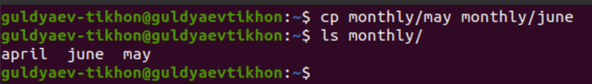
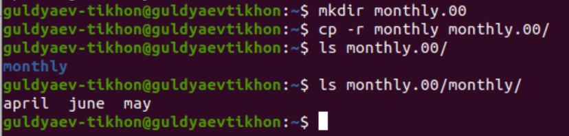
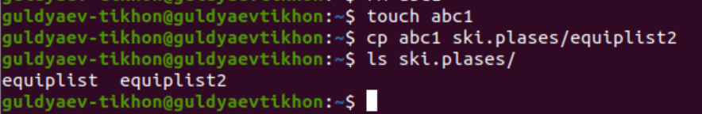
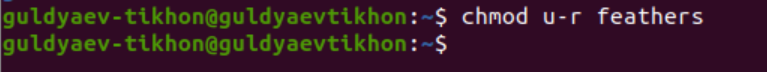

---
## Front matter
title: "Операционные системы"
subtitle: "Лабароторная работа №6"
author: "Гульдяев Тихон Дмитриевич"

## Generic otions
lang: ru-RU
toc-title: "Содержание"

## Bibliography
bibliography: bib/cite.bib
csl: pandoc/csl/gost-r-7-0-5-2008-numeric.csl

## Pdf output format
toc: true # Table of contents
toc-depth: 2
lof: true # List of figures
lot: true # List of tables
fontsize: 12pt
linestretch: 1.5
papersize: a4
documentclass: scrreprt
## I18n polyglossia
polyglossia-lang:
  name: russian
  options:
	- spelling=modern
	- babelshorthands=true
polyglossia-otherlangs:
  name: english
## I18n babel
babel-lang: russian
babel-otherlangs: english
## Fonts
mainfont: PT Serif
romanfont: PT Serif
sansfont: PT Sans
monofont: PT Mono
mainfontoptions: Ligatures=TeX
romanfontoptions: Ligatures=TeX
sansfontoptions: Ligatures=TeX,Scale=MatchLowercase
monofontoptions: Scale=MatchLowercase,Scale=0.9
## Biblatex
biblatex: true
biblio-style: "gost-numeric"
biblatexoptions:
  - parentracker=true
  - backend=biber
  - hyperref=auto
  - language=auto
  - autolang=other*
  - citestyle=gost-numeric
## Pandoc-crossref LaTeX customization
figureTitle: "Рис."
tableTitle: "Таблица"
listingTitle: "Листинг"
lofTitle: "Список иллюстраций"
lotTitle: "Список таблиц"
lolTitle: "Листинги"
## Misc options
indent: true
header-includes:
  - \usepackage{indentfirst}
  - \usepackage{float} # keep figures where there are in the text
  - \floatplacement{figure}{H} # keep figures where there are in the text
---

# Цель работы

Ознакомление с файловой системой Linux, её структурой, именами и содержанием каталогов. Приобретение практических навыков по применению команд для работы с файлами и каталогами, по управлению процессами (и работами), по проверке использования диска и обслуживанию файловой системы.

# Выполнение лабораторной работы

Копирую файл ~/abc1 в файл april и в файл may. (рис. @fig:001).

{#fig:001 width=70%}

Копирую файлы april и may в каталог monthly. (рис. @fig:002).

{#fig:002 width=70%}

Копирую файл monthly/may в файл с именем june.(рис. @fig:003).

{#fig:003 width=70%}

Копирую каталог monthly в каталог monthly.00.(рис. @fig:004).

{#fig:004 width=70%}

Копирую каталог monthly.00 в каталог /tmp.(рис. @fig:005).

{#fig:005 width=70%}

Изменяю название файла april на july в домашнем каталоге.(рис. @fig:006).

{#fig:006 width=70%}

Перемещаю файл july в каталог monthly.00. (рис. @fig:007).

{#fig:007 width=70%}

Переименовываю каталог monthly.00 в monthly.01 (рис. @fig:008).

{#fig:008 width=70%}

Перемещаю каталога monthly.01 в каталог reports (рис. @fig:009).

{#fig:009 width=70%}

Переименовываю каталог reports/monthly.01 в reports/monthly (рис. @fig:010).

{#fig:010 width=70%}

Создаю файл ~/may с правом выполнения для владельца(рис. @fig:011).

{#fig:011 width=70%}

Лишаю владельца файла ~/may права на выполнение. (рис. @fig:012).

{#fig:012 width=70%}

Создаю каталог monthly с запретом на чтение для членов группы и всех остальных пользователей(рис. @fig:013).

{#fig:013 width=70%}

Создаю файл ~/abc1 с правом записи для членов группы: (рис. @fig:014).

{#fig:014 width=70%}

Пример команды fsck (рис. @fig:015).

{#fig:015 width=70%}

Копирую файл /usr/include/aio.h в домашний каталог и называю equipment (рис. @fig:016).

{#fig:016 width=70%}

В домашнем каталоге создаю директорию ~/ski.plases и перемещаю файл equipment в каталог ~/ski.plases (рис. @fig:017).

{#fig:017 width=70%}

Переименовываю файл ~/ski.plases/equipment в ~/ski.plases/equiplist (рис. @fig:018).

{#fig:018 width=70%}

Создаю в домашнем каталоге файл abc1 и копирую его в каталог ~/ski.plases, с именем equiplist2 (рис. @fig:019).

{#fig:019 width=70%}

Создаю каталог с именем equipment в каталоге ~/ski.plases. (рис. @fig:020).

{#fig:020 width=70%}

Перемещаю файлы ~/ski.plases/equiplist и equiplist2 в каталог ~/ski.plases/equipment (рис. @fig:021).

{#fig:021 width=70%}

Создаю и перемещаю каталог ~/newdir в каталог ~/ski.plases и называю его plans (рис. @fig:022).

{#fig:022 width=70%}

Определяю опции команды chmod для drwxr--r-- ... australia и даю права  (рис. @fig:023).

{#fig:023 width=70%}

Определяю опции команды chmod для drwx--x--x ... play и даю права (рис. @fig:024).

{#fig:024 width=70%}

Определяю опции команды chmod для -r-xr--r-- ... my_os и даю права (рис. @fig:025).

{#fig:025 width=70%}

Определяю опции команды chmod для -rw-rw-r-- ... feathers и даю права (рис. @fig:026).

{#fig:026 width=70%}

Просматриваю содержимое файла /etc/password (рис. @fig:027).

{#fig:027 width=70%}

Копирую файл ~/feathers в файл ~/file.old (рис. @fig:028).

{#fig:028 width=70%}

Перемещаю файла ~/file.old в каталог ~/play (рис. @fig:029).

{#fig:029 width=70%}

Копирую каталог ~/play в каталог ~/fun (рис. @fig:030).

{#fig:030 width=70%}

Перемещаю каталог ~/fun в каталог ~/play и называю его games (рис. @fig:031).

{#fig:031 width=70%}

Лишаю владельца файла ~/feathers права на чтение (рис. @fig:032).

{#fig:032 width=70%}

При попытке просмотреть файл ~/feathers командой cat происходит ошибка (рис. @fig:033).

{#fig:033 width=70%}

При попытке скопировать файл ~/feathers происходит ошибка (рис. @fig:034).

{#fig:034 width=70%}

Даю владельцу файла ~/feathers право на чтение (рис. @fig:035).

{#fig:035 width=70%}

Лишаю владельца каталога ~/play права на выполнение (рис. @fig:036).

{#fig:036 width=70%}

Пробую перейти в каталог ~/play, возникает ошибка (рис. @fig:037).

{#fig:037 width=70%}

Даю владельцу каталога ~/play право на выполнение (рис. @fig:038).

{#fig:038 width=70%}

Команда mount используется для монтирования файловых систем в операционной системе Ubuntu. С помощью mount вы можете связать файловую систему, расположенную на устройстве, с определенной точкой монтирования в файловой системе Ubuntu.
Пример команды mount для создание общей папки между Windows и моей виртуальной машиной (рис. @fig:039).

{#fig:039 width=70%}

Команда fsck (File System Consistency Check) используется для проверки и восстановления целостности файловой системы. Это полезно в случае, когда файловая система была повреждена или файлы на ней не отображаются правильно.
Пример команды fsck (рис. @fig:040).

{#fig:040 width=70%}

Команда mkfs используется для создания файловых систем на различных устройствах, таких как жесткие диски и флеш-накопители.
Пример команды mkfs (рис. @fig:041).

{#fig:041 width=70%}

Команда kill используется для отправки сигнала процессу. Сигнал может привести к завершению процесса или изменению его поведения.
Пример команды kill (рис. @fig:042).

{#fig:042 width=70%}

# Выводы

Я ознакомился с файловой системой Linux, её структурой, именами и содержанием каталогов. Приобрел практические навыки по применению команд для работы с файлами и каталогами, по управлению процессами (и работами), по проверке использования диска и обслуживанию файловой системы.

# Ответы на контрольные вопросы

1. Дайте характеристику каждой файловой системе, существующей на жёстком диске компьютера, на котором вы выполняли лабораторную работу.

   Характеристика файловых систем, существующих на жестком диске компьютера, зависит от конкретной системы и ее конфигурации. Однако, наиболее распространенными файловыми системами в Linux являются: ext2, ext3, ext4, XFS, NTFS, FAT32, btrfs, ZFS. Каждая из них имеет свои особенности, преимущества и недостатки.

2. Приведите общую структуру файловой системы и дайте характеристику каждой
   директории первого уровня этой структуры.

   Общая структура файловой системы в Linux имеет иерархическую структуру и начинается с корневой директории "/". Основные директории первого уровня этой структуры включают в себя: /bin (бинарные файлы), /boot (загрузочные файлы), /dev (устройства), /etc (конфигурационные файлы), /home (домашние каталоги пользователей), /lib (библиотеки), /media (точки монтирования для съемных устройств), /mnt (точки монтирования для временных файловых систем), /opt (дополнительные программы), /proc (информация о процессах и системе), /root (домашняя директория суперпользователя), /run (временные файлы для запущенных процессов), /sbin (системные бинарные файлы), /srv (данные для служб), /sys (информация о системе), /tmp (временные файлы), /usr (дополнительные программы и файлы), /var (логи и временные файлы). Каждая директория первого уровня имеет свои особенности и предназначение.

3. Какая операция должна быть выполнена, чтобы содержимое некоторой файловой
   системы было доступно операционной системе?

   Для доступности содержимого файловой системы в Linux ее необходимо смонтировать, то есть присоединить ее к корневой файловой системе. Это можно сделать с помощью команды mount.

4. Назовите основные причины нарушения целостности файловой системы. Как устранить повреждения файловой системы?

   Основными причинами нарушения целостности файловой системы могут быть сбои в работе жесткого диска, ошибки в работе операционной системы, некорректное отключение компьютера, вирусы и другие злонамеренные программы. Чтобы устранить повреждения файловой системы, можно воспользоваться утилитами проверки и восстановления файловой системы, такими как fsck.

5. Как создаётся файловая система?
   Файловая система создается в процессе форматирования диска. Для создания файловой системы можно воспользоваться утилитами, такими как mkfs.

6. Дайте характеристику командам, которые позволяют просмотреть текстовые файлы.

   - cat - показывает содержимое файла
   - ​    less - позволяет просматривать файлы постранично
   - ​    head - выводит первые строки файла
   - ​    tail - выводит последние строки файла
   - ​    grep - позволяет искать строки в файле по заданному шаблону

7.  Приведите основные возможности команды cp в Linux.

   Основные возможности команды cp в Linux: копирование файлов и директорий, возможность задания нового имени файла, возможность копирования рекурсивно (со всем содержимым директории), возможность задания опций для копирования (например, перезапись уже существующих файлов).

8. Назовите и дайте характеристику командам перемещения и переименования файлов и каталогов.

   - mv - перемещение файлов и каталогов, возможность задания нового имени для файла/директории
   - rename - переименование файлов и директорий, возможность задания шаблона для переименования

9. Что такое права доступа? Как они могут быть изменены?

   Права доступа в Linux - это способ определения, кто может просматривать, редактировать и исполнять файлы и директории. Они могут быть изменены с помощью команды chmod, которая позволяет изменять права доступа на уровне пользователя, группы и всех остальных пользователей. Права доступа могут быть выставлены в виде битового значения, состоящего из трех разрядов: r (чтение), w (запись), x (исполнение).

# Список литературы{.unnumbered}

::: {#refs}

https://www.google.ru

https://chat.openai.com/chat

:::
