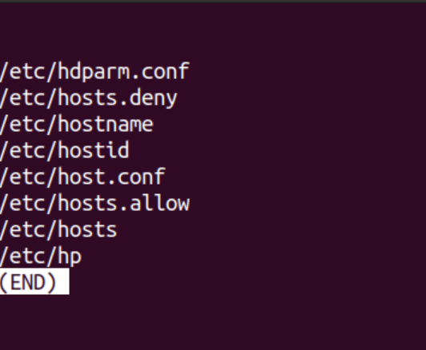
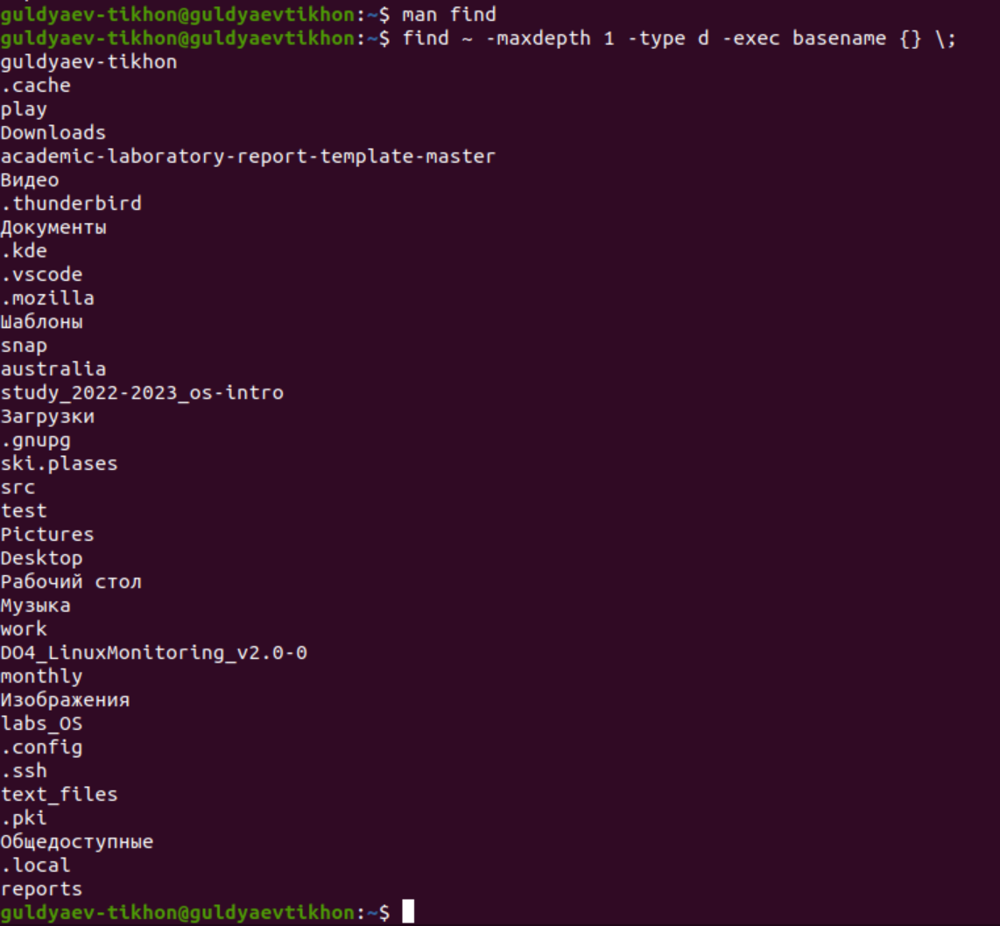

---
## Front matter
title: "Операционные системы"
subtitle: "Лабароторная работа №7"
author: "Гульдяев Тихон Дмитриевич"

## Generic otions
lang: ru-RU
toc-title: "Содержание"

## Bibliography
bibliography: bib/cite.bib
csl: pandoc/csl/gost-r-7-0-5-2008-numeric.csl

## Pdf output format
toc: true # Table of contents
toc-depth: 2
lof: true # List of figures
lot: true # List of tables
fontsize: 12pt
linestretch: 1.5
papersize: a4
documentclass: scrreprt
## I18n polyglossia
polyglossia-lang:
  name: russian
  options:
	- spelling=modern
	- babelshorthands=true
polyglossia-otherlangs:
  name: english
## I18n babel
babel-lang: russian
babel-otherlangs: english
## Fonts
mainfont: PT Serif
romanfont: PT Serif
sansfont: PT Sans
monofont: PT Mono
mainfontoptions: Ligatures=TeX
romanfontoptions: Ligatures=TeX
sansfontoptions: Ligatures=TeX,Scale=MatchLowercase
monofontoptions: Scale=MatchLowercase,Scale=0.9
## Biblatex
biblatex: true
biblio-style: "gost-numeric"
biblatexoptions:
  - parentracker=true
  - backend=biber
  - hyperref=auto
  - language=auto
  - autolang=other*
  - citestyle=gost-numeric
## Pandoc-crossref LaTeX customization
figureTitle: "Рис."
tableTitle: "Таблица"
listingTitle: "Листинг"
lofTitle: "Список иллюстраций"
lotTitle: "Список таблиц"
lolTitle: "Листинги"
## Misc options
indent: true
header-includes:
  - \usepackage{indentfirst}
  - \usepackage{float} # keep figures where there are in the text
  - \floatplacement{figure}{H} # keep figures where there are in the text
---

# Цель работы

Ознакомление с инструментами поиска файлов и фильтрации текстовых данных. Приобретение практических навыков: по управлению процессами (и заданиями), по проверке использования диска и обслуживанию файловых систем.

# Выполнение лабораторной работы

Записываю в файл file.txt названия файлов, содержащихся в каталоге /etc. Проверяя сколько файлов в /etc и сколько стало в file.txt.  (рис. @fig:001).

{#fig:001 width=70%}

Затем, я дописываю в этот же файл названия файлов, содержащихся в моем домашнем каталоге. Проверяя сколько файлов в домашнем каталоге и сколько стало в file.txt. (рис. @fig:002).

{#fig:002 width=70%}

Вывожу имена всех файлов из file.txt, имеющих расширение .conf, после
чего записываю их в новый текстовой файл conf.txt и проверяю их количество. (рис. @fig:003).

{#fig:003 width=70%}

Определяю, какие файлы в моем домашнем каталоге имеют имена, начинавшиеся с символа c. На выбор предоставляю 2 команды. (рис. @fig:004).

{#fig:004 width=70%}

Вывожу на экран (по странично) имена файлов из каталога /etc, начинающиеся с символа h.(рис. @fig:005).

{#fig:005 width=70%}

Использую следующую команду.(рис. @fig:006).

{#fig:006 width=70%}

Запускаю в фоновом режиме процесс, который будет записывать в файл ~/logfile файлы, имена которых начинаются с log. И проверяю количество этих файлов(рис. @fig:007).

{#fig:007 width=70%}

Удаляю файл ~/logfile. (рис. @fig:008).

{#fig:008 width=70%}

Запускаю из консоли в фоновом режиме редактор gedit. (рис. @fig:009).

{#fig:009 width=70%}

Определите идентификатор процесса gedit, используя команду ps, конвейер и
фильтр grep.  (рис. @fig:010).

{#fig:010 width=70%}

Более простой способ определения(рис. @fig:011).

{#fig:011 width=70%}

Читаю справку (man) команды kill, после чего использую её для завершения процесса gedit. (рис. @fig:012).

{#fig:012 width=70%}

Выполняю команду df, предварительно получив более подробную информацию с помощью команды man. (рис. @fig:013).

{#fig:013 width=70%}

Выполняю команду du, предварительно получив более подробную информацию с помощью команды man. (рис. @fig:014).

{#fig:014 width=70%}

Воспользовавшись справкой команды find, вывожу имена всех директорий,
имеющихся в моем домашнем каталоге. (рис. @fig:015).

{#fig:015 width=70%}

# Выводы

Я ознакомился с инструментами поиска файлов и фильтрации текстовых данных. Приобрел практические навыки: по управлению процессами (и заданиями), по проверке использования диска и обслуживанию файловых систем.

# Ответы на контрольные вопросы

1. Какие потоки ввода вывода вы знаете?

   Потоки ввода/вывода, которые я знаю: стандартный ввод (stdin), стандартный вывод (stdout), стандартный вывод ошибок (stderr) и файловые потоки (например, чтение/запись в файлы).

2. Объясните разницу между операцией > и >>.

   Операция ">" используется для перенаправления вывода команды в файл, при этом существующий файл будет перезаписан. Операция ">>" также используется для перенаправления вывода команды в файл, но при этом вывод добавляется в конец файла, не перезаписывая его содержимое.

3. Что такое конвейер?

   Конвейер (pipeline) - это последовательность команд в командной оболочке, где вывод одной команды передается на вход следующей команде без сохранения на диск, что позволяет эффективно обрабатывать большие объемы данных путем их последовательной обработки.

4. Что такое процесс? Чем это понятие отличается от программы?
   Процесс - это экземпляр выполняющейся программы на компьютере, который имеет свое собственное адресное пространство, состояние и потоки выполнения. Программа - это набор инструкций, написанных на языке программирования, предназначенных для выполнения определенных задач на компьютере. Отличие между процессом и программой заключается в том, что процесс является экземпляром программы, который выполняется в оперативной памяти компьютера.

5. Что такое PID и GID?

   PID (Process ID) - это уникальный числовой идентификатор, присвоенный операционной системой процессу, который позволяет идентифицировать и управлять процессами на компьютере. GID (Group ID) - это идентификатор группы, к которой принадлежит процесс в операционной системе, используется для управления доступом к ресурсам, которые могут быть общими для нескольких процессов, принадлежащих одной группе.

6. Что такое задачи и какая команда позволяет ими управлять?

   Задачи - это процессы, которые выполняются в операционной системе. Команда, которая позволяет управлять задачами, в зависимости от операционной системы, может быть различной, например: "ps", "kill", "tasklist", "taskkill" и т. д.

7. Найдите информацию об утилитах top и htop. Каковы их функции?

   Утилиты "top" и "htop" - это инструменты мониторинга процессов в операционной системе Linux/Unix. Они показывают информацию о процессах, такую как использование CPU, памяти, список процессов в реальном времени, и позволяют управлять процессами, такими как завершение или приостановка процессов.

8. Назовите и дайте характеристику команде поиска файлов. Приведите примеры
   использования этой команды.

   Команда поиска файлов в Linux - "find". Она позволяет найти файлы и директории в файловой системе на основе различных критериев, таких как имя файла, размер, дата создания и другие. Некоторые основные опции команды "find" в Linux:

   - -name: Искать файлы с определенным именем или шаблоном имени.
     Пример: find /path/to/directory -name "*.txt" - найдет все файлы с расширением ".txt" в указанной директории и ее поддиректориях.
   - -size: Искать файлы по размеру.
     Пример: find /path/to/directory -size +1M - найдет все файлы размером больше 1 мегабайта в указанной директории и ее поддиректориях.
   - -mtime: Искать файлы по времени последнего изменения.
     Пример: find /path/to/directory -mtime -7 - найдет все файлы, измененные в течение последних 7 дней, в указанной директории и ее поддиректориях.
   - -type: Искать файлы определенного типа (например, файлы, директории, символические ссылки и др.).
     Пример: find /path/to/directory -type f - найдет все обычные файлы в указанной директории и ее поддиректориях.

   Это только некоторые из множества опций, которые можно использовать с командой "find" в Linux. Более подробную информацию о команде "find" и ее опциях можно найти в соответствующей документации.

9. Можно ли по контексту (содержанию) найти файл? Если да, то как?
   Да, в Linux можно найти файлы на основе их содержания с использованием команды "grep". "grep" позволяет искать заданный текст или регулярное выражение в содержимом файлов. Пример использования: grep "search_text" /path/to/file - найдет все вхождения "search_text" в указанном файле.

10. Как определить объем свободной памяти на жёстком диске?

   Для определения объема свободной памяти на жестком диске в Linux можно использовать команду "df". Пример: df -h - отобразит информацию о доступном свободном пространстве на всех подключенных файловых системах в удобочитаемом формате.

11. Как определить объем вашего домашнего каталога?

    Для определения объема вашего домашнего каталога в Linux можно использовать команду "du". Пример: du -sh /path/to/home_directory - отобразит общий размер вашего домашнего каталога в удобочитаемом формате.

12. Как удалить зависший процесс?

    Для удаления зависшего процесса в Linux можно использовать команду "kill". Сначала необходимо определить идентификатор процесса (PID) зависшего процесса с помощью команды "ps" или "top", затем выполнить команду "kill PID" (где PID - идентификатор процесса). Если зависший процесс не реагирует на обычную команду "kill", можно использовать "kill -9 PID" для принудительного завершения процесса.

# Список литературы{.unnumbered}

::: {#refs}

https://www.google.ru

https://chat.openai.com/chat

:::
