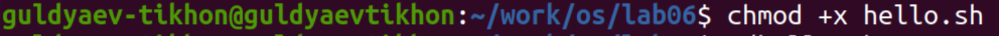

---
## Front matter
title: "Операционные системы"
subtitle: "Лабароторная работа №9"
author: "Гульдяев Тихон Дмитриевич"

## Generic otions
lang: ru-RU
toc-title: "Содержание"

## Bibliography
bibliography: bib/cite.bib
csl: pandoc/csl/gost-r-7-0-5-2008-numeric.csl

## Pdf output format
toc: true # Table of contents
toc-depth: 2
lof: true # List of figures
lot: true # List of tables
fontsize: 12pt
linestretch: 1.5
papersize: a4
documentclass: scrreprt
## I18n polyglossia
polyglossia-lang:
  name: russian
  options:
	- spelling=modern
	- babelshorthands=true
polyglossia-otherlangs:
  name: english
## I18n babel
babel-lang: russian
babel-otherlangs: english
## Fonts
mainfont: PT Serif
romanfont: PT Serif
sansfont: PT Sans
monofont: PT Mono
mainfontoptions: Ligatures=TeX
romanfontoptions: Ligatures=TeX
sansfontoptions: Ligatures=TeX,Scale=MatchLowercase
monofontoptions: Scale=MatchLowercase,Scale=0.9
## Biblatex
biblatex: true
biblio-style: "gost-numeric"
biblatexoptions:
  - parentracker=true
  - backend=biber
  - hyperref=auto
  - language=auto
  - autolang=other*
  - citestyle=gost-numeric
## Pandoc-crossref LaTeX customization
figureTitle: "Рис."
tableTitle: "Таблица"
listingTitle: "Листинг"
lofTitle: "Список иллюстраций"
lotTitle: "Список таблиц"
lolTitle: "Листинги"
## Misc options
indent: true
header-includes:
  - \usepackage{indentfirst}
  - \usepackage{float} # keep figures where there are in the text
  - \floatplacement{figure}{H} # keep figures where there are in the text
---

# Цель работы

Познакомиться с операционной системой Linux. Получить практические навыки работы с редактором vi, установленным по умолчанию практически во всех дистрибутивах.

# Выполнение лабораторной работы

Создаю каталог work/os/lab06 и перехожу в него. (рис. @fig:001).

{#fig:001 width=70%}

Вызываю vi и создаю файл hello.sh  (рис. @fig:002).

{#fig:002 width=70%}

Нажал клавишу i и ввел необходимым код. Также сохраняю файл, сначала перехожу в командный режим нажимая на клавишу esq, затем ввожу : и wq для сохранения и выхода. (рис. @fig:003).

{#fig:003 width=70%}

Делаю файл исполняемым командой chmod (рис. @fig:004).

{#fig:004 width=70%}

Вызываю vi на редактирование файла (рис. @fig:005).

{#fig:005 width=70%}

Меняю HELL на HELLO при помощи режима вставки(i), затем удаляю слово LOCAL сочетанием клавиш dw(установив курсов на начало слова) и через режим вставки ввожу local. Копирую строку echo $HELLO сочетанием клавиш yy и установив курсов в конец вставляю строку клавишей p. Удаляю новую строку сочетанием клавиш dd и отменяю это действие клавишей u. Итог видно на (рис. @fig:006).

{#fig:006 width=70%}

# Выводы

Я познакомился с операционной системой Linux. Получил практические навыки работы с редактором vi, установленным по умолчанию практически во всех дистрибутивах.

# Ответы на контрольные вопросы

1. Дайте краткую характеристику режимам работы редактора vi.

   Редактор vi имеет два режима работы: командный режим и режим вставки. В командном режиме вы можете перемещаться по тексту, удалять, копировать, вставлять и выполнять другие операции. Режим вставки используется для непосредственного ввода текста в документ.

2.  Как выйти из редактора, не сохраняя произведённые изменения?

   Чтобы выйти из редактора vi, не сохраняя произведенные изменения, в командном режиме введите команду :q! и нажмите клавишу Enter.

3. Назовите и дайте краткую характеристику командам позиционирования.

   Команды позиционирования в редакторе vi позволяют перемещаться по тексту без изменения его содержимого. Ниже приведены наиболее часто используемые команды:

   1. h, j, k, l - перемещение курсора на одну позицию влево, вниз, вверх и вправо соответственно.

   2. ​    w - перемещение на начало следующего слова.
   3. ​    b - перемещение на начало предыдущего слова.
   4. ​    0 - перемещение к началу строки.
   5. ​    $ - перемещение к концу строки.
   6. ​    G - перемещение к указанной строке (например, 5G перемещает курсор на пятую строку).
   7. ​    gg - перемещение к началу файла.
   8. ​    H - перемещение к верхней строке экрана.
   9. ​    M - перемещение к средней строке экрана.
   10. ​    L - перемещение к нижней строке экрана.

   Кроме того, можно использовать относительные номера строк, используя команду + или -. Например, +5 перемещает курсор на пять строк вниз, а -3 перемещает на три строки вверх.

4. Что для редактора vi является словом?

   В редакторе vi слово (word) - это непрерывная последовательность символов, не содержащая пробельных символов (пробел, табуляция и перенос строки).

   Для перемещения курсора на слово вперед или назад используются команды w и b соответственно. Команда w перемещает курсор к началу следующего слова, а команда b - к началу предыдущего слова.

   При работе с командами, связанными со словами, стоит учитывать, что vi использует некоторые расширенные правила определения слов. Например, символ подчеркивания (_), рассматривается как часть слова, а знаки доллара ($) и процента (%) считаются границами слов.

5. Каким образом из любого места редактируемого файла перейти в начало (конец) файла?

   В редакторе vi можно перейти в начало или конец файла из любой позиции в файле, используя соответствующие команды:

   - Для перехода в начало файла нажмите клавишу Shift и g. Или в режиме командной строки введите команду :0 и нажмите Enter.
   - Для перехода в конец файла нажмите клавишу g и Shift сразу после нажатия на g. Или в режиме командной строки введите команду :$ и нажмите Enter.

   Обратите внимание, что символы : и $ используются в командной строке vi для указания команд и адресации строк в файле. Символ $ обозначает последнюю строку в файле. При вводе команды в режиме командной строки символы : и $ можно не набирать, если команда начинается с цифры (например, 0 или 100).

6. Назовите и дайте краткую характеристику основным группам команд редактирования.

   В редакторе vi все команды редактирования делятся на несколько групп:

   1. Команды вставки текста: позволяют вставлять текст в файл. Команды включают i (вставить перед курсором), a (вставить после курсора), A (вставить в конец строки) и o (вставить новую строку ниже текущей строки).
   2. Команды изменения текста: позволяют изменять текст в файле. Команды включают r (заменить один символ), c (изменить часть текста) и s (заменить часть текста).
   3. Команды удаления текста: позволяют удалять текст из файла. Команды включают x (удалить один символ), dd (удалить строку), D (удалить текст от текущей позиции до конца строки) и :1,$d (удалить все строки в файле).
   4. Команды копирования и перемещения текста: позволяют копировать и перемещать текст в файле. Команды включают y (скопировать), yy (скопировать строку), p (вставить скопированный текст после курсора), P (вставить скопированный текст перед курсором), :1,5co10 (скопировать строки 1-5 и вставить их после строки 10) и :1,5m10 (переместить строки 1-5 после строки 10).
   5. Команды отмены и повтора действий: позволяют отменять и повторять предыдущие действия. Команды включают u (отменить предыдущее действие), Ctrl+r (повторить отмененное действие) и ., (повторить последнее действие).
   6. Команды поиска и замены: позволяют находить и заменять текст в файле. Команды включают / (поиск), ? (поиск в обратном направлении), :s/old/new/g (замена old на new в текущей строке), :%s/old/new/g (замена old на new во всем файле) и :1,$s/old/new/g (замена old на new в строках 1-конца файла).

7. Необходимо заполнить строку символами $. Каковы ваши действия?

     В редакторе vi можно заполнить строку символами $ с помощью следующих шагов:

     1. Перейдите к началу строки, в которую нужно вставить символы $. Для этого нажмите клавишу 0 или перейдите к нужной позиции курсора в режиме командной строки.
     2. Войдите в режим вставки текста, нажав клавишу i.
     3. Наберите символ $ столько раз, сколько нужно, чтобы заполнить строку. Можно также использовать команду вставки повторения символа, например, 10$ вставит символ $ 10 раз.
     4. После того, как строка заполнена символами $, нажмите клавишу Esc, чтобы вернуться в режим команд.

     Если необходимо повторить вставку строки с символами $ несколько раз, можно использовать команду копирования и вставки. Например, 5yy скопирует текущую строку, а затем 5p вставит ее 5 раз подряд.

8. Как отменить некорректное действие, связанное с процессом редактирования?

   В редакторе vi можно отменить некорректное действие, связанное с процессом редактирования, с помощью команды "отмена" (undo). Для этого нужно нажать клавишу u в режиме команд. Эта команда отменит последнее выполненное действие. Если требуется отменить несколько действий, можно продолжать нажимать клавишу u для последовательной отмены действий до нужного состояния файла.

   Если же нужно отменить все изменения, внесенные в файл после его открытия, можно воспользоваться командой "возврат к начальному состоянию файла" (revert). Для этого нужно в режиме команд ввести команду :e!, после чего файл будет перезагружен в исходном состоянии, не сохраняя при этом внесенные изменения.

9. Назовите и дайте характеристику основным группам команд режима последней строки.

   В редакторе vi команды режима последней строки выполняются в режиме команд из строки команд, которая находится внизу экрана и начинается с символа ":". Эти команды можно разделить на несколько групп:

   1. Команды сохранения и выхода: :w, :wq, :x, :q, :q!. Команда :w сохраняет текущий файл, а команда :wq сохраняет файл и выходит из редактора. Команда :x сохраняет файл и выходит из редактора, только если файл был изменен. Команда :q выходит из редактора, если файл не был изменен, а команда :q! выходит из редактора без сохранения изменений.
   2. Команды перемещения по файлу: :n, :p, :gg, :G. Команда :n переходит к следующей строке файла, а команда :p переходит к предыдущей строке. Команда :gg переходит к началу файла, а команда :G переходит к концу файла.
   3. Команды поиска и замены: /, :s. Команда / используется для поиска текста в файле. После ввода команды нужно ввести искомый текст, затем нажать клавишу Enter. Команда :s используется для замены текста в файле. После ввода команды нужно указать, какой текст нужно заменить, и на что его нужно заменить.
   4. Команды отображения информации о файле и редакторе: :set, :set all, :version. Команда :set используется для отображения или изменения параметров редактора. Команда :set all отображает все параметры редактора. Команда :version отображает информацию о версии редактора.
   5. Команды выполнения внешних программ: :!, :r. Команда :! позволяет выполнить внешнюю программу из редактора. Команда :r позволяет вставить вывод выполненной внешней программы в текущую позицию курсора.

   Кроме этих основных групп команд, в режиме последней строки можно использовать и другие команды, например, для переименования файла (:rename), открытия нового файла (:e), переключения в другой режим (:visual, :insert) и т.д.

   

10. Как определить, не перемещая курсора, позицию, в которой заканчивается строка?

    В редакторе vi можно определить, не перемещая курсора, позицию, в которой заканчивается строка, используя следующие комбинации клавиш в командном режиме:

    - $: перемещает курсор в конец текущей строки.
    - g_: перемещает курсор в конец текущей строки, игнорируя пробельные символы в конце строки.

    Таким образом, чтобы узнать позицию, в которой заканчивается строка, нужно нажать одну из этих комбинаций клавиш, и курсор переместится в конец строки, без изменения текущей позиции курсора. Для возврата курсора в исходную позицию можно нажать клавишу Ctrl+o.

11. Выполните анализ опций редактора vi (сколько их, как узнать их назначение и т.д.).

    Редактор vi имеет множество опций, которые позволяют настроить его поведение под различные потребности.

    Опций в vi очень много, и некоторые из них могут различаться в зависимости от версии и реализации редактора. Однако, можно узнать список доступных опций и их текущие значения, используя команду set в командном режиме. Примеры команд:

    - :set all - показывает все доступные опции и их текущие значения.
    - :set - показывает только опции, которые были изменены от значения по умолчанию.

    Кроме того, можно установить значения опций во время выполнения vi с помощью команды set в командном режиме. Например, чтобы включить подсветку синтаксиса при редактировании файлов программ на языке C, можно использовать команду :set syntax=c.

    Некоторые основные опции в vi включают:

    - autoindent - автоматически добавляет отступы в новых строках в соответствии с предыдущей строкой.
    - number - отображает номера строк.
    - tabstop - задает количество пробелов, которые эквивалентны одному символу табуляции.
    - ignorecase - игнорирует регистр при поиске текста.
    - smartindent - автоматически определяет уровень отступа при вводе кода в новой строке.
    - expandtab - заменяет символы табуляции пробелами.
    - wrap - переносит строки, чтобы они соответствовали ширине экрана.

    Опции в vi можно настраивать на постоянной основе, записав их в файл конфигурации, который читается при запуске редактора. Для большинства версий vi это файл ~/.exrc или ~/.vimrc.

12. Как определить режим работы редактора vi?

    Редактор vi имеет три основных режима работы: командный (command mode), вставки (insert mode) и последней строки (last line mode). Определить текущий режим работы можно по цвету приглашения в командной строке, а также по поведению редактора при вводе команд.

    - Командный режим (command mode) - это режим по умолчанию при запуске редактора vi. В этом режиме можно перемещаться по файлу, удалять и копировать текст, и выполнять другие команды. Цвет приглашения в командной строке обычно белый.
    - Режим вставки (insert mode) - используется для ввода текста. Цвет приглашения в командной строке обычно зеленый. Для перехода в режим вставки можно использовать команду i, a, o, в зависимости от того, где вы хотите вставить текст.
    - Режим последней строки (last line mode) - используется для ввода команд, которые начинаются с символа :. В этом режиме можно сохранить файл, выполнить поиск, замену и т.д. Цвет приглашения в командной строке обычно желтый. Чтобы перейти в режим последней строки, нужно нажать клавишу : в командном режиме.

    Также можно определить текущий режим работы редактора по поведению клавиш и команд. Например, в командном режиме клавиши перемещения курсора перемещают курсор, а в режиме вставки эти же клавиши вставляют символы. В режиме последней строки команды начинаются с символа :, а в остальных режимах этот символ просто вставляется в текст.

13. Постройте граф взаимосвязи режимов работы редактора vi

    Граф взаимосвязи режимов работы редактора vi (рис. @fig:007).

    {#fig:007 width=70%}

    Режим команд (Command Mode) является основным режимом работы редактора vi, из которого можно перейти в два других режима: режим вставки (Insert Mode) и режим последней строки (Last Line Mode).

    В режиме вставки (Insert Mode) можно вводить текст, при этом нажатие большинства клавиш будет добавлять символы в текст.

    Режим последней строки (Last Line Mode) используется для ввода команд, начинающихся с символа :. В этом режиме можно сохранить файл, выполнить поиск, замену и т.д. Также можно перейти в режим вставки, введя команду i, a, o, в зависимости от того, где вы хотите вставить текст.

    Переходы между режимами осуществляются с помощью соответствующих команд или клавиш. Например, для перехода в режим вставки нужно нажать клавишу i, а для перехода в режим последней строки нужно нажать символ : в командном режиме.

# Список литературы{.unnumbered}

::: {#refs}

https://www.google.ru

https://chat.openai.com/chat

:::
