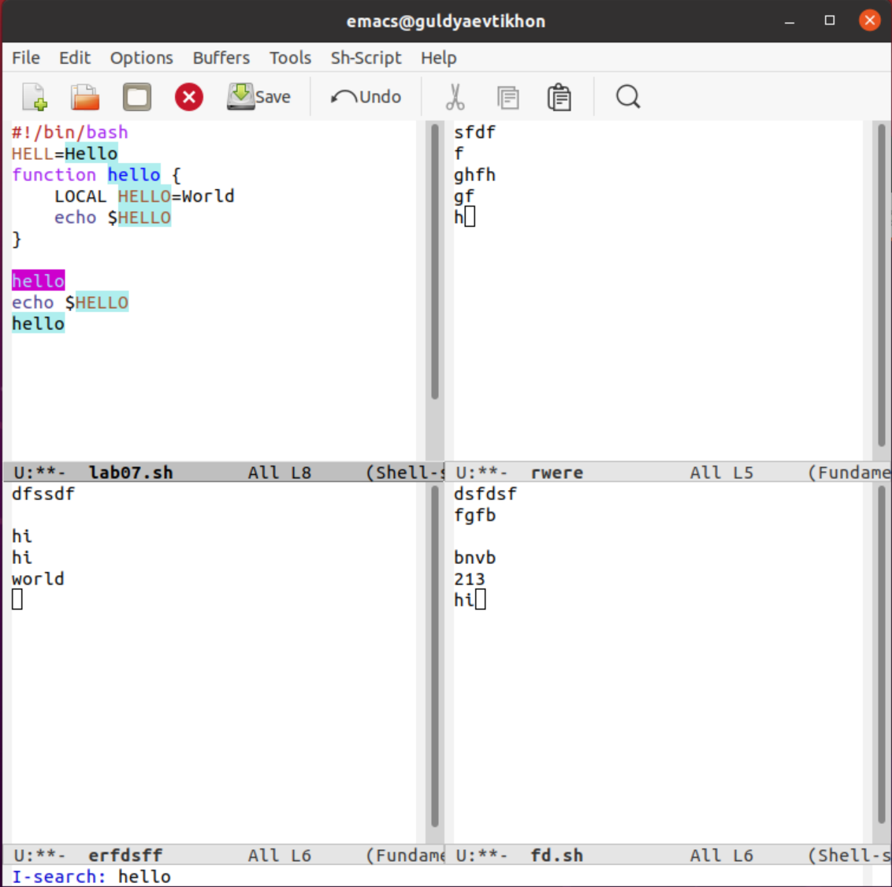

---
## Front matter
title: "Операционные системы"
subtitle: "Лабароторная работа №10"
author: "Гульдяев Тихон Дмитриевич"

## Generic otions
lang: ru-RU
toc-title: "Содержание"

## Bibliography
bibliography: bib/cite.bib
csl: pandoc/csl/gost-r-7-0-5-2008-numeric.csl

## Pdf output format
toc: true # Table of contents
toc-depth: 2
lof: true # List of figures
lot: true # List of tables
fontsize: 12pt
linestretch: 1.5
papersize: a4
documentclass: scrreprt
## I18n polyglossia
polyglossia-lang:
  name: russian
  options:
	- spelling=modern
	- babelshorthands=true
polyglossia-otherlangs:
  name: english
## I18n babel
babel-lang: russian
babel-otherlangs: english
## Fonts
mainfont: PT Serif
romanfont: PT Serif
sansfont: PT Sans
monofont: PT Mono
mainfontoptions: Ligatures=TeX
romanfontoptions: Ligatures=TeX
sansfontoptions: Ligatures=TeX,Scale=MatchLowercase
monofontoptions: Scale=MatchLowercase,Scale=0.9
## Biblatex
biblatex: true
biblio-style: "gost-numeric"
biblatexoptions:
  - parentracker=true
  - backend=biber
  - hyperref=auto
  - language=auto
  - autolang=other*
  - citestyle=gost-numeric
## Pandoc-crossref LaTeX customization
figureTitle: "Рис."
tableTitle: "Таблица"
listingTitle: "Листинг"
lofTitle: "Список иллюстраций"
lotTitle: "Список таблиц"
lolTitle: "Листинги"
## Misc options
indent: true
header-includes:
  - \usepackage{indentfirst}
  - \usepackage{float} # keep figures where there are in the text
  - \floatplacement{figure}{H} # keep figures where there are in the text
---

# Цель работы

Познакомиться с операционной системой Linux. Получить практические навыки работы с редактором Emacs.

# Выполнение лабораторной работы

Открываю emacs. (рис. @fig:001).

{#fig:001 width=70%}

Создать файл lab07.sh с помощью комбинации (Ctrl+x Ctrl+f) и набираю в нем необходимый текст.  (рис. @fig:002).

{#fig:002 width=70%}

Большинство действий просты, и фиксировать каждое не целесообразно.

Сохраняю файл с помощью комбинации (Ctrl+x Ctrl+s). Вырезаю одной командой целую строку (Ctrl+k). Вставляю эту строку в конец файла (Ctrl+y). Выделяю область текста (Ctrl+space). Копирую область в буфер обмена (Shift+w). Вставляю область в конец файла.(Ctrl+y) Вновь выделяю эту область и на этот раз вырезать её (Ctrl+w). Отменяю последнее действие (Ctrl+/).

Перемещаю курсор в начало строки (Ctrl+a). Перемещаю курсор в конец строки (Ctrl+e). Перемещаю курсор в начало буфера (Shift+<). Перемещаю курсор в конец буфера (Shift+>).

Вывожу список активных буферов на экран (Ctrl+x Ctrl+b). Перемещаюсь во вновь открытое окно ((Ctrl+x) + o) со списком открытых буферов и переключаюсь на другой буфер(рис. @fig:003) и закрываю это окно (Ctrl+x 0). И вновь переключаюсь между буферами, но уже без вывода их списка на экран (Ctrl+x b)

{#fig:003 width=70%}

Делю фрейм на 4 части: делю фрейм на два окна по вертикали
(Ctrl+x 3), а затем каждое из этих окон на две части по горизонтали (Ctrl+x 2). В каждом из четырёх созданных окон открываю новый буфер (файл) и ввожу несколько строк текста. (рис. @fig:004).

{#fig:004 width=70%}

Переключаюсь в режим поиска (Ctrl+s) и нахожу несколько слов, присутствующих в тексте (рис. @fig:005). Переключаюсь между результатами поиска, нажимая (Ctrl+s) и выхожу из режима поиска, нажав (Ctrl+g).

{#fig:005 width=70%}

Переходу в режим поиска и замены (Shift+%), ввожу текст, который следует найти и заменить(рис. @fig:006), нажимаю Enter, затем ввожу текст для замены. После того как подсвечены результаты поиска, нажимаю ! для подтверждения замены.

{#fig:006 width=70%}

Пробую другой режим поиска, нажав (Shift+s) + o). Этот режим позволяет использовать регулярные выражения(рис. @fig:007).

{#fig:007 width=70%}

# Выводы

Я познакомился с операционной системой Linux. Получил практические навыки работы с редактором Emacs.

# Ответы на контрольные вопросы

1. Кратко охарактеризуйте редактор emacs.

   Emacs - это расширяемый текстовый редактор с многими функциями, который позволяет пользователю выполнить множество задач, начиная от написания кода до редактирования текстовых файлов и управления файловой системой.

2. Какие особенности данного редактора могут сделать его сложным для освоения новичком?

   Одной из основных особенностей Emacs является наличие обширной системы команд и клавиатурных сочетаний, которые могут сделать его сложным для начинающих пользователей. Однако, если пользователь готов потратить время на изучение команд и настройку редактора под свои нужды, то Emacs может стать мощным инструментом для редактирования текста.

3. Своими словами опишите, что такое буфер и окно в терминологии emacs’а.

   В терминологии Emacs, буфер - это область памяти, которая содержит текстовую информацию. Окно - это пространство, где можно просмотреть содержимое буфера.

4. Можно ли открыть больше 10 буферов в одном окне?

   Да, в Emacs можно открыть более 10 буферов в одном окне.

5. Какие буферы создаются по умолчанию при запуске emacs?

   При запуске Emacs создаются несколько буферов, включая буфер scratch, который используется для экспериментов и тестов, и буфер Messages, который содержит сообщения об ошибках и предупреждениях.

6. Какие клавиши вы нажмёте, чтобы ввести следующую комбинацию C-c | и C-c C-|?

   Для ввода комбинации C-c | нужно нажать клавиши "Control" и "C" одновременно, затем нажать клавишу "|". Для ввода комбинации C-c C-| нужно нажать клавиши "Control" и "C" одновременно, затем нажать клавишу "Shift" и "|" одновременно.

7. Как поделить текущее окно на две части?

     Чтобы поделить текущее окно на две части, нужно нажать клавишу "Control" и "X" одновременно, затем нажать клавишу "3". Эта комбинация создаст новое окно справа от текущего окна.

8. В каком файле хранятся настройки редактора emacs?

   Настройки редактора Emacs хранятся в файле ".emacs" или ".emacs.d/init.el". В этих файлах можно указать настройки редактора, установить дополнительные плагины и настроить сочетания клавиш.

9. Какую функцию выполняет клавиша (стрелочка налево) и можно ли её переназначить?

   Клавиша (стрелочка налево) выполняет функцию перемещения курсора на один символ влево. Эту клавишу можно переназначить, используя функции настройки редактора Emacs.

10. Какой редактор вам показался удобнее в работе vi или emacs? Поясните почему.

     Vi более простой и минималистичный, удобнее работать.(а еще оказывается есть vim!!!!! и вообще редакторов много, не обязательно выбирать их, можно вообще в vs code хотя бы писать)

# Список литературы{.unnumbered}

::: {#refs}

https://www.google.ru

https://chat.openai.com/chat

:::
