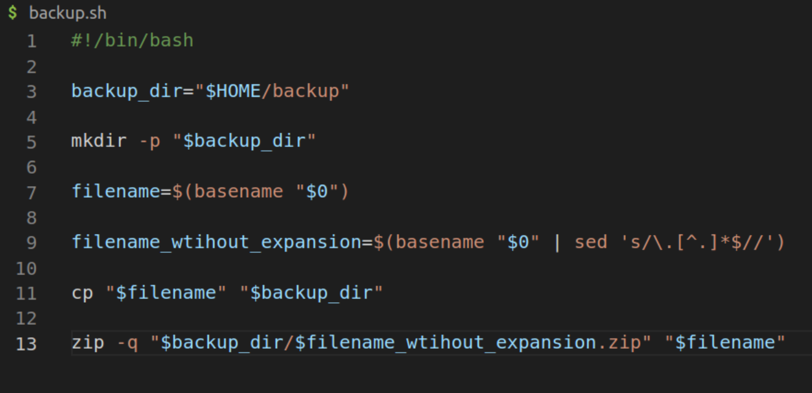
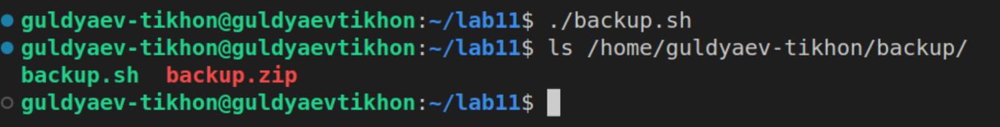
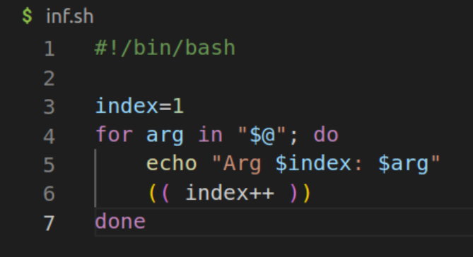
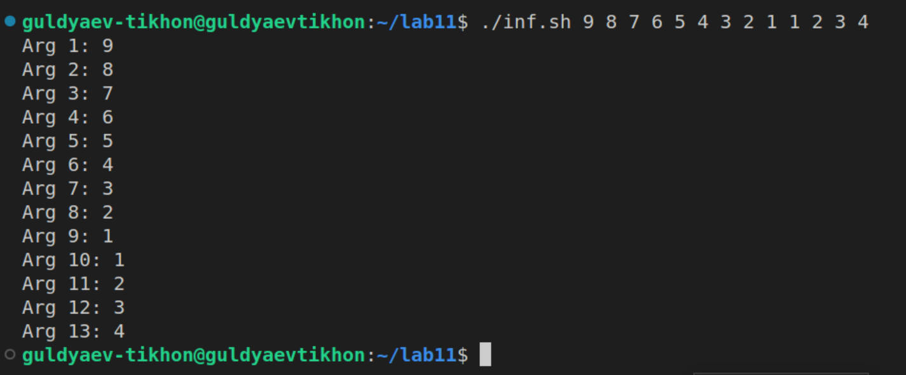
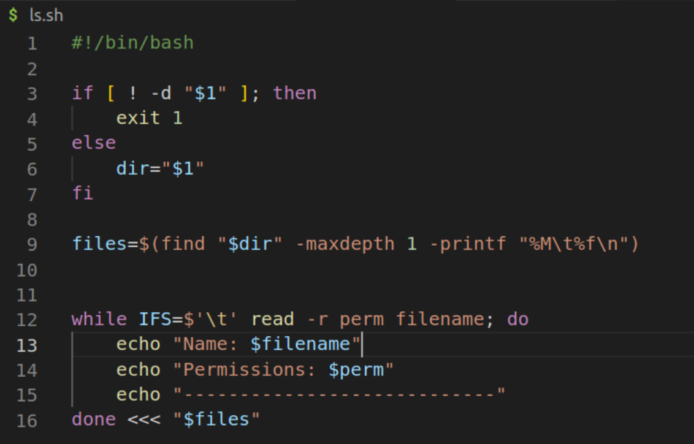
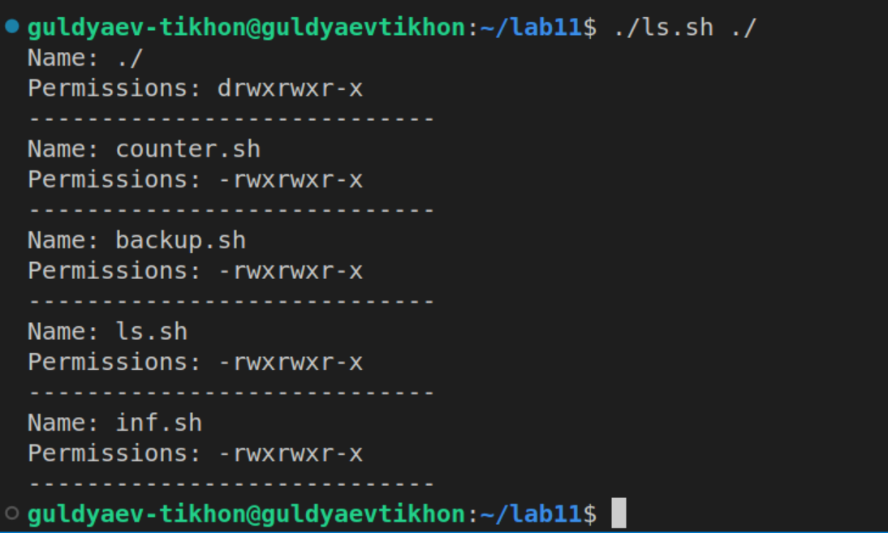
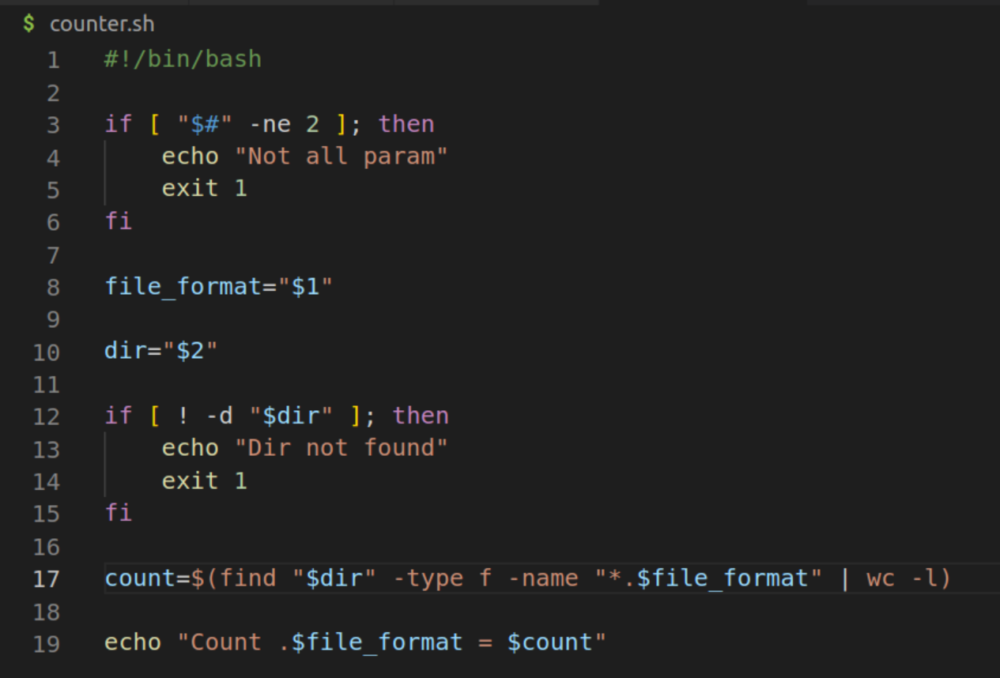
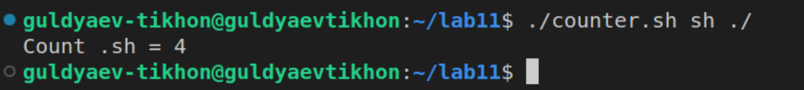

---
## Front matter
title: "Операционные системы"
subtitle: "Лабароторная работа №11"
author: "Гульдяев Тихон Дмитриевич"

## Generic otions
lang: ru-RU
toc-title: "Содержание"

## Bibliography
bibliography: bib/cite.bib
csl: pandoc/csl/gost-r-7-0-5-2008-numeric.csl

## Pdf output format
toc: true # Table of contents
toc-depth: 2
lof: true # List of figures
lot: true # List of tables
fontsize: 12pt
linestretch: 1.5
papersize: a4
documentclass: scrreprt
## I18n polyglossia
polyglossia-lang:
  name: russian
  options:
	- spelling=modern
	- babelshorthands=true
polyglossia-otherlangs:
  name: english
## I18n babel
babel-lang: russian
babel-otherlangs: english
## Fonts
mainfont: PT Serif
romanfont: PT Serif
sansfont: PT Sans
monofont: PT Mono
mainfontoptions: Ligatures=TeX
romanfontoptions: Ligatures=TeX
sansfontoptions: Ligatures=TeX,Scale=MatchLowercase
monofontoptions: Scale=MatchLowercase,Scale=0.9
## Biblatex
biblatex: true
biblio-style: "gost-numeric"
biblatexoptions:
  - parentracker=true
  - backend=biber
  - hyperref=auto
  - language=auto
  - autolang=other*
  - citestyle=gost-numeric
## Pandoc-crossref LaTeX customization
figureTitle: "Рис."
tableTitle: "Таблица"
listingTitle: "Листинг"
lofTitle: "Список иллюстраций"
lotTitle: "Список таблиц"
lolTitle: "Листинги"
## Misc options
indent: true
header-includes:
  - \usepackage{indentfirst}
  - \usepackage{float} # keep figures where there are in the text
  - \floatplacement{figure}{H} # keep figures where there are in the text
---

# Цель работы

Изучить основы программирования в оболочке ОС UNIX/Linux. Научиться писать небольшие командные файлы.

# Выполнение лабораторной работы

Я создал сценарий для создания резервной копии себя. В начале скрипта я определил переменную backup_dir, которая содержит путь к директории, в которой будут храниться резервные копии. Если эта директория не существует, то я создал её, используя команду 
```mkdir -p "$backup_dir"```

Затем я определил имя текущего скрипта с помощью команды ```basename "$0"``` и сохранил его в переменную filename. Для создания имени файла без расширения я использовал команду ```basename "$0" | sed 's/\.[^.]*$//'``` и сохранил результат в переменную filename_without_extension.

Далее я скопировал текущий скрипт в директорию резервных копий, используя команду ```cp "$filename" "$backup_dir"```. Теперь в директории ```"backup"``` находится копия текущего скрипта.

В заключении, я создал zip-архив резервной копии скрипта с помощью команды ```zip -q "$backup_dir/$filename_without_extension.zip" "$filename"``` Это позволяет упаковать скопированный файл в архив и сохранить его в директории ```"backup"``` с расширением ```".zip"```

Таким образом, этот скрипт автоматизирует процесс создания резервной копии самого себя и сохранения её в указанной директории. (рис. @fig:001).

{#fig:001 width=70%}

Результат выполнения данного скрипта.  (рис. @fig:002).

{#fig:002 width=70%}

Я создал сценарий, который позволяет перебирать аргументы командной строки, переданные при запуске скрипта. Я использовал цикл for для этой цели.

Внутри цикла я использовал переменную index для отслеживания порядкового номера аргумента, начиная с 1. Для каждого аргумента я использовал команду echo для вывода информации в формате ```"Arg <номер>: <аргумент>"``` После вывода информации о текущем аргументе я увеличивал значение переменной index на единицу, чтобы перейти к следующему аргументу.

Таким образом, когда этот скрипт выполняется, он перебирает все аргументы командной строки, переданные при его запуске, и выводит их порядковый номер и значение. Это позволяет удобно просмотреть и использовать переданные аргументы внутри скрипта.  (рис. @fig:003) 

{#fig:003 width=70%}

Результат выполнения данного скрипта. (рис. @fig:004).

{#fig:004 width=70%}

 Я создал сценарий, который принимает в качестве аргумента путь к директории. Сначала я проверяю, существует ли указанная директория, используя условную конструкцию ```if [ ! -d "$1" ]; then``` Если директория не существует, то скрипт завершает свое выполнение с кодом ошибки 1 с помощью команды exit 1. В противном случае, если директория существует, я сохраняю ее путь в переменную dir.

Затем я использую команду find для поиска файлов в указанной директории с максимальной глубиной 1. Формат вывода каждого файла задан с помощью опции ```-printf "%M\t%f\n"```, где %M представляет разрешения файла, ```\t``` - символ табуляции, а %f - имя файла. Результат сохраняется в переменной files.

Далее я использую цикл while для итерации по строкам переменной files. Читая строки по разделителю табуляции (заданному ```IFS=$'\t'```), я присваиваю значения разрешений файлу (perm) и имени файла (filename). Внутри цикла я вывожу информацию о каждом файле с помощью команды echo, включая имя файла и его разрешения.

Таким образом, этот скрипт проверяет существование указанной директории, а затем выводит информацию о файлах, находящихся в этой директории, включая их имена и разрешения. (рис. @fig:005). 

{#fig:005 width=70%}

Результат выполнения данного скрипта. (рис. @fig:006).

{#fig:006 width=70%}

Я создал сценарий, который принимает два аргумента командной строки: формат файла и путь к директории. Сначала я проверяю, что количество переданных аргументов равно 2, используя условное выражение ```[ "$#" -ne 2 ]``` Если количество аргументов не равно 2, то я вывожу сообщение ```"Not all param"``` с помощью команды echo и завершаю скрипт с кодом ошибки 1 с помощью команды exit 1.

Затем я сохраняю первый аргумент (формат файла) в переменной file_format и второй аргумент (путь к директории) в переменной dir.

После этого я проверяю, существует ли указанная директория, используя условное выражение ```[ ! -d "$dir" ]``` Если директория не существует, то я вывожу сообщение ```"Dir not found"``` с помощью команды echo и завершаю скрипт с кодом ошибки 1.

Затем я использую команду find для поиска файлов в указанной директории ($dir), имеющих указанный формат (*.$file_format). Я использую опции -type f для поиска только обычных файлов. Результат передаю в команду wc -l, которая считает количество строк, чтобы определить количество файлов.

После этого я вывожу информацию о количестве файлов с указанным форматом с помощью команды echo, включая значение переменной file_format и подсчитанное количество count.

Таким образом, этот скрипт проверяет наличие двух переданных аргументов командной строки, ищет файлы в указанной директории с заданным форматом, и выводит информацию о количестве найденных файлов с этим форматом. (рис. @fig:007).

{#fig:007 width=70%}

Результат выполнения данного скрипта. (рис. @fig:008).

{#fig:008 width=70%}

# Выводы

Я изучил основы программирования в оболочке ОС UNIX/Linux. Научился писать небольшие командные файлы.

# Ответы на контрольные вопросы

1. Объясните понятие командной оболочки. Приведите примеры командных оболочек. Чем они отличаются?

   Командная оболочка (или просто оболочка) - это программа интерфейса командной строки, которая предоставляет пользователю возможность взаимодействия с операционной системой посредством ввода команд. Оболочка обеспечивает запуск команд, выполнение скриптов, управление процессами, переменными окружения, файловой системой и другими аспектами операционной системы.

   Примеры командных оболочек:

   1. Bash (Bourne Again SHell): Это одна из самых популярных и широко используемых оболочек в UNIX-подобных системах. Она представляет собой расширение и усовершенствованную версию оригинальной оболочки Bourne Shell (sh). Bash имеет множество возможностей, включая поддержку скриптования, переменных окружения, расширенный синтаксис команд и многое другое.
   2. Zsh (Z Shell): Это расширенная оболочка командной строки, которая предоставляет дополнительные возможности по сравнению с Bash. Она поддерживает расширенный автодополнение, темы оформления, функции-генераторы и другие продвинутые функции.
   3. Csh (C Shell): Эта оболочка получила свое название похожее на язык программирования C из-за синтаксиса, вдохновленного C. Она предлагает более удобный и интуитивно понятный синтаксис для выполнения команд и скриптов.
   4. Fish (Friendly Interactive SHell): Это современная оболочка, известная своим простым и понятным синтаксисом, автодополнением и другими дружественными пользователю функциями.

   Отличия между различными командными оболочками заключаются в их синтаксисе, возможностях и функциях. Некоторые оболочки имеют расширенные возможности, такие как более продвинутое автодополнение, интуитивный интерфейс, дополнительные команды и функции. Каждая оболочка также может иметь свои особенности и отличия в области совместимости со скриптами и настройками окружения. Выбор оболочки зависит от предпочтений пользователя, требований и совместимости с конкретной системой.

2. Что такое POSIX?

   POSIX (Portable Operating System Interface) - это стандарт, определяющий набор интерфейсов программирования прикладных приложений (API), команд командной строки и другие основные функции операционной системы. Он создан для обеспечения переносимости программного обеспечения между различными операционными системами, предоставляя единые стандарты для системных вызовов, команд и файловой системы.

3. Как определяются переменные и массивы в языке программирования bash?

   В языке программирования Bash переменные и массивы определяются следующим образом:

   1. Переменные:
      - ​    Присваивание значения переменной: variable=value.
      - ​    Обратите внимание, что в Bash нет жесткой типизации, поэтому переменные не требуют объявления типа данных.
      - ​    Имена переменных чувствительны к регистру, например, myVariable и myvariable будут различными переменными.
      - ​    При обращении к значению переменной используется символ доллара $: echo $variable.
   2. Массивы:
      -  Создание массива: array=(value1 value2 value3).
      -   Обращение к элементам массива: ```${array[index]}```, где index - индекс элемента массива (начиная с 0).

   Обратите внимание, что в Bash нет отдельных операций для объявления размера массива или изменения его размера. Массивы могут быть динамическими и изменяться при добавлении или удалении элементов.

4. Каково назначение операторов let и read?

   Оператор let в языке программирования Bash используется для выполнения арифметических вычислений. Он позволяет присваивать значения переменным и выполнять математические операции, такие как сложение, вычитание, умножение и деление.

   Оператор read используется для чтения ввода пользователя в командной строке и присваивания его значений переменным. Он позволяет программе взаимодействовать с пользователем, запрашивая ввод данных.

   Оба оператора let и read являются часто используемыми инструментами в Bash для выполнения арифметических вычислений и ввода данных от пользователя соответственно.

5. Какие арифметические операции можно применять в языке программирования bash?

   В языке программирования bash можно использовать следующие арифметические операции:

   - сложение: +
   - вычитание: -
   - умножение: *
   - деление: /
   - остаток от деления: %
   - инкремент: ++
   - декремент: --

   Операции инкремента и декремента также могут быть использованы с помощью команд let и ((...)) для изменения значения переменной.

6. Что означает операция (( ))?

   Операция (( )) в языке программирования Bash используется для выполнения арифметических вычислений и логических операций. Она представляет собой арифметический контекст или подконтекст, в котором можно выполнять сложение, вычитание, умножение, деление, сравнение чисел и другие арифметические операции.

   Операция (( )) предоставляет более гибкий и мощный способ выполнения арифметических и логических операций в сравнении с оператором let или простыми арифметическими операторами.

7. Какие стандартные имена переменных Вам известны?

   - HOME: Содержит путь к домашнему каталогу текущего пользователя.
   - PWD: Содержит путь к текущему рабочему каталогу.
   - USER: Содержит имя текущего пользователя.
   - SHELL: Содержит путь к исполняемому файлу текущей оболочки.
   - PATH: Содержит список путей, разделенных двоеточием, в которых операционная система ищет исполняемые файлы.
   - IFS: Определяет символы-разделители полей при разбиении строк на слова.
   - RANDOM: Содержит случайное число.
   - PPID: Содержит идентификатор родительского процесса.

8. Что такое метасимволы?

   Метасимволы - это специальные символы или символьные комбинации, которые имеют особое значение или функцию в контексте оболочки или командной строки. Они используются для выполнения различных операций, таких как поиск, замена, сопоставление шаблонов и управление потоками ввода-вывода.

   Метасимволы играют важную роль в обработке команд и шаблонов в языке Bash, позволяя более гибко и мощно управлять выполнением программ и обработкой данных.

9. Как экранировать метасимволы?

   Для экранирования метасимволов в языке программирования Bash используется символ обратной косой черты (\). Помещение символа обратной косой черты перед метасимволом превращает его в литеральный символ, т.е. символ будет воспринят буквально, а не в качестве специального символа с особым значением.Для экранирования метасимволов в языке программирования Bash используется символ обратной косой черты (\). Помещение символа обратной косой черты перед метасимволом превращает его в литеральный символ, т.е. символ будет воспринят буквально, а не в качестве специального символа с особым значением.

10. Как создавать и запускать командные файлы?

    Для создания и запуска командных файлов в языке программирования Bash, следуйте следующим шагам:

    1. Создайте новый файл с расширением .sh. Например, script.sh.
    2. Откройте файл в текстовом редакторе и напишите команды, которые вы хотите выполнить. Каждая команда должна быть записана на отдельной строке.
    3. Добавьте в начало файла шебанг (shebang), который указывает на используемую командную оболочку. В случае Bash это будет #!/bin/bash.
    4. Сохраните файл и закройте текстовый редактор.
    5. Дайте файлу права на выполнение с помощью команды chmod +x script.sh. Это позволит запускать файл как исполняемый.
    6. Запустите командный файл, введя в терминале его имя с полным путем или просто его имя, если он находится в текущем рабочем каталоге. Например, ./script.sh или script.sh.

    Командный файл будет выполнен в командной оболочке Bash, и его содержимое будет последовательно выполняться в соответствии с написанными командами.

11. Как определяются функции в языке программирования bash?

    В языке программирования Bash функции определяются следующим образом:

    1. Используйте ключевое слово function (необязательно) или просто название функции, за которым следуют круглые скобки ().
    2. После открывающей скобки указывается список параметров функции (необязательно).
    3. В фигурных скобках {} записывается тело функции, содержащее команды, которые нужно выполнить.
    4. По завершении тела функции используйте ключевое слово return (необязательно), чтобы вернуть значение из функции.

12. Каким образом можно выяснить, является файл каталогом или обычным файлом?

    Для выяснения, является ли файл каталогом или обычным файлом в языке программирования bash, можно использовать команду test или её эквивалент ```[``` в сочетании с опцией -d, которая проверяет, является ли файл каталогом.

13. Каково назначение команд set, typeset и unset?

    - set: Команда set в языке программирования bash используется для установки или изменения значений различных настроек оболочки. Она позволяет управлять режимами работы скрипта, обработкой ошибок, переменными окружения и другими параметрами оболочки.
    - typeset: Команда typeset в языке программирования bash используется для объявления и управления переменными. Она позволяет устанавливать типы переменных, задавать атрибуты (такие как локальность или только чтение) и управлять их значениями.
    - unset: Команда unset в языке программирования bash используется для удаления переменных или функций. Она позволяет очистить память, ранее занимаемую переменными, и освободить ресурсы. Удаление переменной делает ее недоступной для дальнейшего использования в скрипте.

14. Как передаются параметры в командные файлы?

    Параметры в командные файлы передаются через аргументы командной строки. При запуске командного файла можно указать значения параметров, которые будут доступны внутри файла для обработки.

    В языке программирования bash параметры передаются в виде переменных с именами $1, $2, $3 и так далее. Где $1 - это первый параметр, $2 - второй параметр и так далее. Первый параметр $1 содержит значение первого аргумента командной строки, второй параметр $2 содержит значение второго аргумента и так далее.

15. Назовите специальные переменные языка bash и их назначение.

    Некоторые специальные переменные в языке программирования Bash и их назначение:

        $0: Имя самого скрипта.
        $1, $2, $3, и так далее: Аргументы командной строки, переданные в скрипт.
        $@: Список всех аргументов командной строки.
        $#: Количество аргументов командной строки.
        $?: Код возврата последней выполненной команды.
        $$: PID (идентификатор процесса) скрипта.
        $!: PID последнего фонового процесса.
        $PWD: Текущий рабочий каталог (полный путь).
        $HOME: Домашний каталог текущего пользователя.
        $USER: Имя текущего пользователя.
        $HOSTNAME: Имя текущего хоста.

    Каждая из этих переменных имеет свое специфическое назначение и содержит определенную информацию о среде выполнения скрипта или системы.

# Список литературы{.unnumbered}

::: {#refs}

https://www.google.ru

https://chat.openai.com/chat

:::

