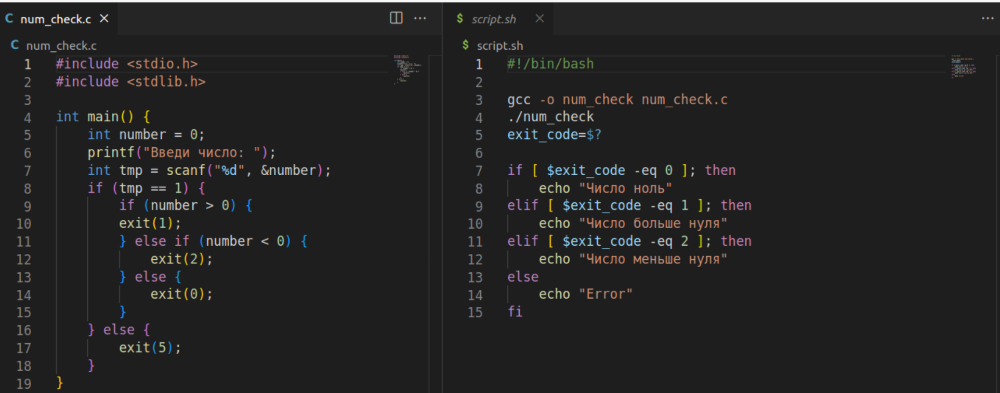

---
## Front matter
title: "Операционные системы"
subtitle: "Лабароторная работа №12"
author: "Гульдяев Тихон Дмитриевич"

## Generic otions
lang: ru-RU
toc-title: "Содержание"

## Bibliography
bibliography: bib/cite.bib
csl: pandoc/csl/gost-r-7-0-5-2008-numeric.csl

## Pdf output format
toc: true # Table of contents
toc-depth: 2
lof: true # List of figures
lot: true # List of tables
fontsize: 12pt
linestretch: 1.5
papersize: a4
documentclass: scrreprt
## I18n polyglossia
polyglossia-lang:
  name: russian
  options:
	- spelling=modern
	- babelshorthands=true
polyglossia-otherlangs:
  name: english
## I18n babel
babel-lang: russian
babel-otherlangs: english
## Fonts
mainfont: PT Serif
romanfont: PT Serif
sansfont: PT Sans
monofont: PT Mono
mainfontoptions: Ligatures=TeX
romanfontoptions: Ligatures=TeX
sansfontoptions: Ligatures=TeX,Scale=MatchLowercase
monofontoptions: Scale=MatchLowercase,Scale=0.9
## Biblatex
biblatex: true
biblio-style: "gost-numeric"
biblatexoptions:
  - parentracker=true
  - backend=biber
  - hyperref=auto
  - language=auto
  - autolang=other*
  - citestyle=gost-numeric
## Pandoc-crossref LaTeX customization
figureTitle: "Рис."
tableTitle: "Таблица"
listingTitle: "Листинг"
lofTitle: "Список иллюстраций"
lotTitle: "Список таблиц"
lolTitle: "Листинги"
## Misc options
indent: true
header-includes:
  - \usepackage{indentfirst}
  - \usepackage{float} # keep figures where there are in the text
  - \floatplacement{figure}{H} # keep figures where there are in the text
---

# Цель работы

Изучить основы программирования в оболочке ОС UNIX. Научится писать более сложные командные файлы с использованием логических управляющих конструкций и циклов.

# Выполнение лабораторной работы

Первая программа:

Используя команды getopts grep, написать командный файл, который анали-
зирует командную строку с ключами:
– -i inputfile — прочитать данные из указанного файла;
– -o outputfile — вывести данные в указанный файл;
– -p шаблон — указать шаблон для поиска;
– -C — различать большие и малые буквы;
– -n — выдавать номера строк.
а затем ищет в указанном файле нужные строки, определяемые ключом -p.

Код первой программы. (рис. @fig:001).

{#fig:001 width=70%}

Пример использования первой программы.  (рис. @fig:002).

{#fig:002 width=70%}

Вторая программа и скрипт:

Написать на языке Си программу, которая вводит число и определяет, является ли оно больше нуля, меньше нуля или равно нулю. Затем программа завершается с помощью функции exit(n), передавая информацию в о коде завершения в оболочку. Командный файл должен вызывать эту программу и, проанализировав с помощью команды $?, выдать сообщение о том, какое число было введено.

Код второй программы и скрипта (рис. @fig:003) 

{#fig:003 width=70%}

Пример использования второй программы и скрипта. (рис. @fig:004).

{#fig:004 width=70%}

Третья программа:

Написать командный файл, создающий указанное число файлов, пронумерованных последовательно от 1 до N (например 1.tmp, 2.tmp, 3.tmp,4.tmp и т.д.).
Число файлов, которые необходимо создать, передаётся в аргументы командной строки. Этот же командный файл должен уметь удалять все созданные им файлы (если они существуют).

Код третьей программы. (рис. @fig:005). 

{#fig:005 width=70%}

Пример использования третьей программы. (рис. @fig:006).

{#fig:006 width=70%}

Четвертая программа:

Написать командный файл, который с помощью команды tar запаковывает в архив все файлы в указанной директории. Модифицировать его так, чтобы запаковывались только те файлы, которые были изменены менее недели тому назад (использовать команду find)

Код четвертой программы. (рис. @fig:007).

{#fig:007 width=70%}

Пример использования четвертой программы. (рис. @fig:008).

{#fig:008 width=70%}

Второй пример использования четвертой программы. (рис. @fig:009).

{#fig:009 width=70%}

# Выводы

Я изучил основы программирования в оболочке ОС UNIX. Научился писать более сложные командные файлы с использованием логических управляющих конструкций и циклов.

# Ответы на контрольные вопросы

1. Каково предназначение команды getopts?

   Команда getopts используется в скриптах на языке shell для обработки опций командной строки. Она позволяет определить опции и их аргументы, переданные скрипту, и обработать их соответствующим образом.

2. Какое отношение метасимволы имеют к генерации имён файлов?

   Метасимволы (такие как *, ?, [ ] и другие) используются в шелле для генерации имён файлов. Они позволяют сопоставлять имена файлов с определенными шаблонами и выполнять операции с соответствующими файлами.

3. Какие операторы управления действиями вы знаете?

   Операторы управления действиями включают условные операторы (if, case), операторы цикла (for, while, until) и операторы переадресации ввода-вывода (>, <, | и другие). Они позволяют контролировать выполнение команд в скрипте и управлять потоками данных.

4. Какие операторы используются для прерывания цикла?

   Для прерывания цикла в языке shell используются операторы break и continue. Оператор break прерывает выполнение цикла и передает управление за пределы цикла, а оператор continue прерывает текущую итерацию цикла и переходит к следующей итерации.

5. Для чего нужны команды false и true?

   Команда false возвращает значение "ложь" (код возврата 1), а команда true возвращает значение "истина" (код возврата 0). Обычно они используются для создания заглушек или фиктивных команд, которые всегда возвращают ожидаемые значения, независимо от выполняемых действий.

6. Что означает строка if test -f man$s/$i.$s, встреченная в командном файле?

   Данная строка является условием проверки в командном файле (скрипте). В ней используется команда test с опцией -f, которая проверяет, является ли файл с именем, сформированным из переменных $s, $i и $s, обычным файлом. Если условие истинно, то выполняется соответствующий блок кода.

7. Объясните различия между конструкциями while и until.

   Конструкция while выполняет блок кода, пока условие истинно, тогда как конструкция until выполняет блок кода, пока условие ложно. То есть, while выполняет цикл, пока условие остается истинным, а until выполняет цикл, пока условие не станет истинным.

# Список литературы{.unnumbered}

::: {#refs}

https://www.google.ru

https://chat.openai.com/chat

:::

