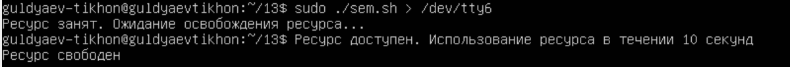

---
## Front matter
title: "Операционные системы"
subtitle: "Лабароторная работа №13"
author: "Гульдяев Тихон Дмитриевич"

## Generic otions
lang: ru-RU
toc-title: "Содержание"

## Bibliography
bibliography: bib/cite.bib
csl: pandoc/csl/gost-r-7-0-5-2008-numeric.csl

## Pdf output format
toc: true # Table of contents
toc-depth: 2
lof: true # List of figures
lot: true # List of tables
fontsize: 12pt
linestretch: 1.5
papersize: a4
documentclass: scrreprt
## I18n polyglossia
polyglossia-lang:
  name: russian
  options:
	- spelling=modern
	- babelshorthands=true
polyglossia-otherlangs:
  name: english
## I18n babel
babel-lang: russian
babel-otherlangs: english
## Fonts
mainfont: PT Serif
romanfont: PT Serif
sansfont: PT Sans
monofont: PT Mono
mainfontoptions: Ligatures=TeX
romanfontoptions: Ligatures=TeX
sansfontoptions: Ligatures=TeX,Scale=MatchLowercase
monofontoptions: Scale=MatchLowercase,Scale=0.9
## Biblatex
biblatex: true
biblio-style: "gost-numeric"
biblatexoptions:
  - parentracker=true
  - backend=biber
  - hyperref=auto
  - language=auto
  - autolang=other*
  - citestyle=gost-numeric
## Pandoc-crossref LaTeX customization
figureTitle: "Рис."
tableTitle: "Таблица"
listingTitle: "Листинг"
lofTitle: "Список иллюстраций"
lotTitle: "Список таблиц"
lolTitle: "Листинги"
## Misc options
indent: true
header-includes:
  - \usepackage{indentfirst}
  - \usepackage{float} # keep figures where there are in the text
  - \floatplacement{figure}{H} # keep figures where there are in the text
---

# Цель работы

Изучить основы программирования в оболочке ОС UNIX. Научиться писать более сложные командные файлы с использованием логических управляющих конструкций и циклов.

# Выполнение лабораторной работы

Первая программа:

Написать командный файл, реализующий упрощённый механизм семафоров. Командный файл должен в течение некоторого времени t1 дожидаться освобождения ресурса, выдавая об этом сообщение, а дождавшись его освобождения, использовать его в течение некоторого времени t2<>t1, также выдавая информацию о том, что ресурс используется соответствующим командным файлом (процессом). Запустить командный файл в одном виртуальном терминале в фоновом режиме, перенаправив его вывод в другой (> /dev/tty#, где # — номер терминала куда перенаправляется вывод), в котором также запущен этот файл, но не фоновом, а в привилегированном режиме. Доработать программу так, чтобы имелась возможность взаимодействия трёх и более процессов

Код первой программы. (рис. @fig:001).

{#fig:001 width=70%}

В привелегированном режиме запущен на tty5, tty4, в фоновом в tty3(запускались в порядке tty5, tty4, tty3), перенаправление в следующий по счету. На рисунках отображены все используемые терминалы  (рис. @fig:002), (рис. @fig:003), (рис. @fig:004), (рис. @fig:005).

{#fig:002 width=70%}

{#fig:003 width=70%}

{#fig:004 width=70%}

{#fig:005 width=70%}

Вторая программа:

Реализовать команду man с помощью командного файла. Изучите содержимое каталога /usr/share/man/man1. В нем находятся архивы текстовых файлов, содержащих справку по большинству установленных в системе программ и команд. Каждый архив можно открыть командой less сразу же просмотрев содержимое справки. Командный файл должен получать в виде аргумента командной строки название команды и в виде результата выдавать справку об этой команде или сообщение об отсутствии справки, если соответствующего файла нет в каталоге man1.

Код второй программы (рис. @fig:006) 

{#fig:006 width=70%}

Пример использования второй программы, получение справки для ls. (рис. @fig:007).

{#fig:007 width=70%}

Третья программа:

Используя встроенную переменную $RANDOM, напишите командный файл, генерирующий случайную последовательность букв латинского алфавита. Учтите, что $RANDOM выдаёт псевдослучайные числа в диапазоне от 0 до 32767. Код третьей программы. (рис. @fig:008). 

{#fig:008 width=70%}

Пример использования третьей программы. (рис. @fig:009).

{#fig:009 width=70%}

# Выводы

Я изучил основы программирования в оболочке ОС UNIX. Научился писать более сложные командные файлы с использованием логических управляющих конструкций и циклов.

# Ответы на контрольные вопросы

1. Найдите синтаксическую ошибку в следующей строке:
   ```while [$1 != "exit"]```

   Синтаксическая ошибка в данной строке заключается в отсутствии пробелов вокруг символа [ и отсутствие кавычек вокруг переменной $1. Верное написание строки будет следующим:

   ```while [ "$1" != "exit" ]```

2. Как объединить (конкатенация) несколько строк в одну?

   - Использование оператора конкатенации +=

   - Использование оператора конкатенации внутри кавычек 

     ```concatenated_string="${string1}${string2}"``` 

   - Использование команды printf с форматированием

      ```concatenated_string=$(printf "%s%s" "$string1" "$string2")```

3. Найдите информацию об утилите seq. Какими иными способами можно реализовать её функционал при программировании на bash?

   Утилита seq в Bash используется для генерации числовых последовательностей. Ее функциональность состоит в создании последовательности чисел от начального значения до конечного значения с заданным шагом.

   Некоторые альтернативные способы реализации функционала seq в программировании на Bash включают:

   - Использование цикла for с инкрементом
   - Использование цикла while с инкрементом
   - Использование массива и цикла for

4. Какой результат даст вычисление выражения ```$((10/3))```?

   Выражение ```$((10/3))``` в Bash будет вычислено как деление 10 на 3, а результат будет округлен вниз до целого числа. В данном случае результат будет равен 3.

5. Укажите кратко основные отличия командной оболочки zsh от bash.

   Ниже приведены основные отличия между командными оболочками zsh и bash:

   1. Синтаксис и расширенные возможности: Zsh предлагает более расширенный и мощный синтаксис команд, включая автозаполнение (Tab completion) с подсказками, расширенные шаблоны и множество встроенных функций.
   2. Автозаполнение и автодополнение: Zsh имеет более продвинутую систему автозаполнения, которая может предложить варианты завершения команд и аргументов, основываясь на истории команд, путях файловой системы и других контекстных данных.
   3. Поддержка смены рабочей директории: В Zsh можно быстро переключаться между рабочими директориями без необходимости указывать полный путь.
   4. Настройка и темы оформления: Zsh предлагает более гибкую и мощную систему настройки и настройку тем оформления для командной строки.
   5. Лучшая обработка ошибок: Zsh обрабатывает ошибки более информативно, позволяя легче понять, что пошло не так при выполнении команд.
   6. Удобные и продвинутые возможности истории команд: Zsh предоставляет расширенные функции работы с историей команд, включая поиск, фильтрацию, удаление дубликатов и другие возможности.
   7. Скорость выполнения команд: В некоторых сценариях Zsh может быть быстрее в выполнении команд и операций, чем Bash.

   Однако стоит отметить, что Bash является более широко распространенной командной оболочкой и поставляется по умолчанию во многих системах Linux. Отличия между Zsh и Bash могут быть важны для опытных пользователей, которые хотят настроить свою командную оболочку под свои нужды и предпочтения.

6. Проверьте, верен ли синтаксис данной конструкции ```for ((a=1; a <= LIMIT; a++))```

   Синтаксис данной конструкции в целом верен, но вам необходимо определить значение переменной LIMIT перед использованием цикла.

7. Сравните язык bash с какими-либо языками программирования. Какие преимущества у bash по сравнению с ними? Какие недостатки?

   Преимущества языка bash:

   - Простота использования и быстрота разработки для автоматизации задач командной строки и скриптования.
   - Встроенная поддержка многих системных утилит и команд операционной системы.
   - Широкая доступность и предустановленность в большинстве Unix-подобных систем.
   - Удобное управление файлами, потоками и процессами через конвейеры и перенаправления.
   - Интеграция с системными сервисами и инструментами, такими как cron, systemd и другими.

   Недостатки языка bash:

   - Ограниченные возможности для разработки сложных и масштабируемых приложений.
   - Нет поддержки типов данных, структур данных и объектно-ориентированного программирования.
   - Неэффективность при выполнении сложных вычислений и больших объемов данных.
   - Отсутствие расширенной обработки ошибок и исключений.
   - Ограниченные возможности для создания графического интерфейса или веб-приложений.

   Сравнивая bash с языками программирования C и Python, следует отметить, что bash является специализированным языком для работы с командной строкой и автоматизации системных задач, в то время как C и Python более общепринятые языки программирования с широким спектром применения. C обеспечивает более низкоуровневый доступ к системным ресурсам и эффективность, но требует более глубокого понимания и имеет более сложный синтаксис. Python обладает более высоким уровнем абстракции, богатым набором библиотек и инструментов, поддерживает объектно-ориентированное программирование и широко применяется для разработки веб-приложений, научных вычислений и автоматизации задач.

   В итоге, bash предоставляет простой и удобный способ для автоматизации системных задач и работы с командной строкой, но ограничен в возможностях программирования по сравнению с C и Python, которые предлагают более общие инструменты и гибкость для разработки различных видов приложений.

# Список литературы{.unnumbered}

::: {#refs}

https://www.google.ru

https://chat.openai.com/chat

:::

