---
## Front matter
title: "Операционные системы"
subtitle: "Лабароторная работа №14"
author: "Гульдяев Тихон Дмитриевич"

## Generic otions
lang: ru-RU
toc-title: "Содержание"

## Bibliography
bibliography: bib/cite.bib
csl: pandoc/csl/gost-r-7-0-5-2008-numeric.csl

## Pdf output format
toc: true # Table of contents
toc-depth: 2
lof: true # List of figures
lot: true # List of tables
fontsize: 12pt
linestretch: 1.5
papersize: a4
documentclass: scrreprt
## I18n polyglossia
polyglossia-lang:
  name: russian
  options:
	- spelling=modern
	- babelshorthands=true
polyglossia-otherlangs:
  name: english
## I18n babel
babel-lang: russian
babel-otherlangs: english
## Fonts
mainfont: PT Serif
romanfont: PT Serif
sansfont: PT Sans
monofont: PT Mono
mainfontoptions: Ligatures=TeX
romanfontoptions: Ligatures=TeX
sansfontoptions: Ligatures=TeX,Scale=MatchLowercase
monofontoptions: Scale=MatchLowercase,Scale=0.9
## Biblatex
biblatex: true
biblio-style: "gost-numeric"
biblatexoptions:
  - parentracker=true
  - backend=biber
  - hyperref=auto
  - language=auto
  - autolang=other*
  - citestyle=gost-numeric
## Pandoc-crossref LaTeX customization
figureTitle: "Рис."
tableTitle: "Таблица"
listingTitle: "Листинг"
lofTitle: "Список иллюстраций"
lotTitle: "Список таблиц"
lolTitle: "Листинги"
## Misc options
indent: true
header-includes:
  - \usepackage{indentfirst}
  - \usepackage{float} # keep figures where there are in the text
  - \floatplacement{figure}{H} # keep figures where there are in the text
---

# Цель работы

Приобрести простейшие навыки разработки, анализа, тестирования и отладки приложений в ОС типа UNIX/Linux на примере создания на языке программирования С калькулятора с простейшими функциями.

# Выполнение лабораторной работы

В домашнем каталоге создаю подкаталог ~/work/os/lab_prog. (рис. @fig:001).

{#fig:001 width=70%}

Создаю в нём файлы: calculate.h, calculate.c, main.c.(рис. @fig:002) И заполняю их согласно приложенному коду.

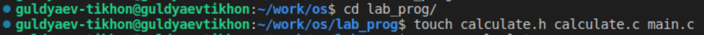{#fig:002 width=70%}

Выполняю компиляцию программы посредством gcc, с первого раза не получается из-за ошибки, после ее исправления (рис. @fig:003) все компилируется и я проверяю работу калькулятора (рис. @fig:004)

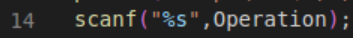{#fig:003 width=70%}

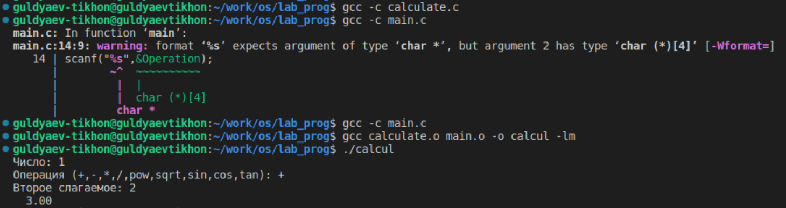{#fig:004 width=70%}

Создаю Makefile согласно приложенному коду (рис. @fig:005).

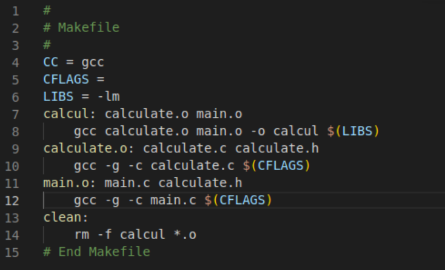{#fig:005 width=70%}

Этот Makefile используется для компиляции и создания исполняемого файла calcul. Давайте рассмотрим его содержимое по шагам:

1. CC = gcc: Эта строка определяет переменную CC, которая устанавливает компилятор C на gcc.
2. CFLAGS =: Эта строка определяет переменную CFLAGS, которая представляет флаги компилятора C. В данном случае, переменная не содержит никаких флагов, поэтому она остается пустой.
3. LIBS = -lm: Эта строка определяет переменную LIBS, которая представляет библиотеки, которые должны быть связаны с программой при компиляции. В данном случае, -lm указывает на библиотеку математических функций.
4. calcul: calculate.o main.o: Эта строка определяет цель calcul, которая зависит от файлов calculate.o и main.o. Если эти файлы изменились, цель calcul будет пересобрана.
5. gcc calculate.o main.o -o calcul $(LIBS): Эта строка определяет правило для создания исполняемого файла calcul. Она использует компилятор gcc для компиляции calculate.o и main.o вместе с библиотеками, определенными в переменной LIBS, и создает исполняемый файл calcul.
6. calculate.o: calculate.c calculate.h: Эта строка определяет правило для создания файла calculate.o. Она указывает, что calculate.o зависит от файлов calculate.c и calculate.h. Если эти файлы изменились, calculate.o будет пересобран.
7. gcc -g -c calculate.c $(CFLAGS): Эта строка определяет команду компиляции для файла calculate.c. Она использует компилятор gcc с флагом -g для включения отладочной информации и флагами, определенными в переменной CFLAGS, и создает объектный файл calculate.o.
8. main.o: main.c calculate.h: Эта строка определяет правило для создания файла main.o. Она указывает, что main.o зависит от файлов main.c и calculate.h. Если эти файлы изменились, main.o будет пересобран.
9. gcc -g -c main.c $(CFLAGS): Эта строка определяет команду компиляции для файла main.c. Она использует компилятор gcc с флагом -g для включения отладочной информации и флагами, определенными в переменной CFLAGS, и создает объектный файл main.o.
10. clean: rm -f calcul *.o: Эта строка определяет цель clean, которая используется для удаления всех объектных файлов (*.o) и исполняемого файла calcul. При запуске команды make clean все эти файлы будут удалены.

С помощью gdb выполняю отладку программы calcul.

Запускаю отладчик GDB, загрузив в него программу для отладки и ввожу команду run (рис. @fig:006) 

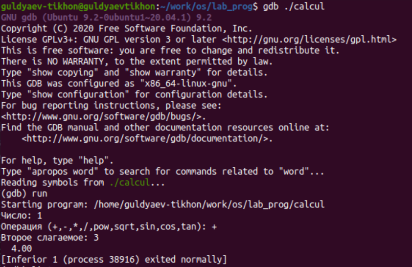{#fig:006 width=70%}

Для постраничного (по 9 строк) просмотра исходного код использую команду list, а для просмотра строк с 12 по 15 основного файла использую list с параметрами(list calculate.c:20,29) и для просмотра определённых строк не основного файла использую list с параметрами(list calculate.c:20,29) (рис. @fig:007).

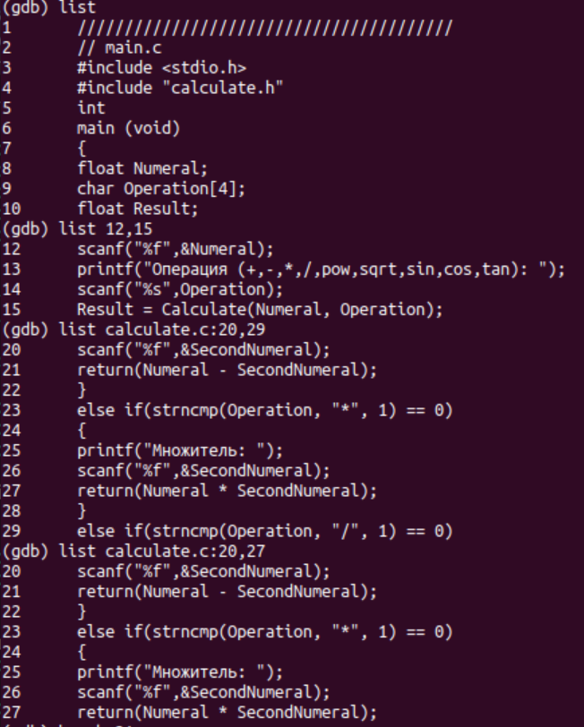{#fig:007 width=70%}

Устанавливаю точку останова в файле calculate.c на строке номер 21 и вывожу информацию об имеющихся в проекте точка останова (рис. @fig:008). 

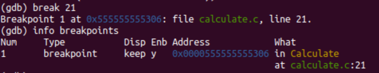{#fig:008 width=70%}

Запускаю программу внутри отладчика и вижу, что программа останавливается в момент прохождения точки останова (рис. @fig:009).

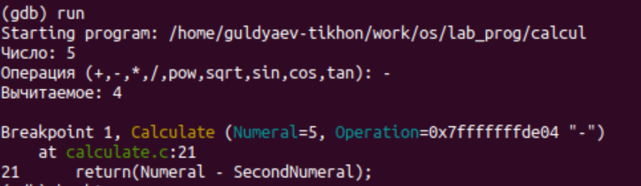{#fig:009 width=70%}

Команда backtrace показывает весь стек вызываемых функций от начала программы до текущего места (рис. @fig:010).

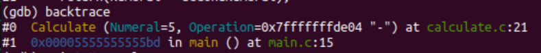{#fig:010 width=70%}

Смотрю, чему равно на этом этапе значение переменной Numeral (print Numeral) и сравниваю с результатом вывода на экран после использования команды display Numeral, оба вывода равны 5 (рис. @fig:011).

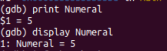{#fig:011 width=70%}

Уберию точки останова (рис. @fig:012).

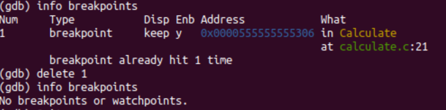{#fig:012 width=70%}

С помощью утилиты splint анализирую код файлаcalculate.c (рис. @fig:013).

1. calculate.h:5:37: Предупреждение указывает на то, что параметр функции Operation объявлен как манифестный массив (с указанием размера), но размер игнорируется, так как параметр массива обрабатывается как указатель. Предлагается использовать флаг -fixedformalarray, чтобы подавить это предупреждение.
2. calculate.c:8:31: То же предупреждение, как и в предыдущем случае, указывает на то, что параметр функции Operation объявлен как манифестный массив, но размер игнорируется.
3. calculate.c:14:1, calculate.c:20:1, calculate.c:26:1, calculate.c:32:1, calculate.c:44:1: Предупреждения указывают на игнорирование возвращаемого значения функции scanf. Результат функции scanf не используется. Можно привести результат к типу (void), чтобы устранить предупреждение. Использование флага -retvalint подавляет это предупреждение.
4. calculate.c:33:4: Предупреждение указывает на опасное сравнение на равенство (==) между числами с плавающей запятой (float). Рекомендуется сравнивать разницу между числами с плавающей запятой и использовать FLT_EPSILON или DBL_EPSILON. Использование флага -realcompare подавляет это предупреждение.
5. calculate.c:36:7, calculate.c:45:7, calculate.c:48:7, calculate.c:50:7, calculate.c:52:7, calculate.c:54:7, calculate.c:58:7: Предупреждения указывают на несоответствие типов возвращаемого значения функций. Возвращаемое значение указано как double, но ожидается тип float. Использование флага -relaxtypes позволяет сопоставлять все числовые типы.

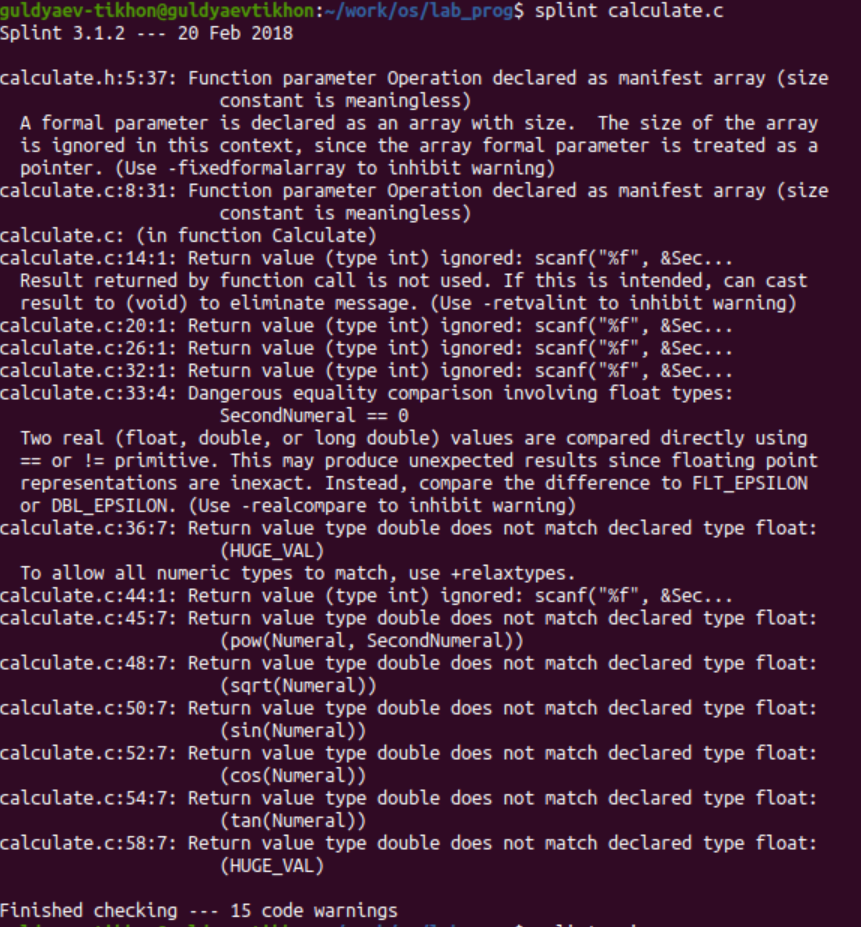{#fig:013 width=70%}

С помощью утилиты splint анализирую код файла main.c  (рис. @fig:014).

1. calculate.h:5:37: Предупреждение указывает на то, что параметр функции Operation объявлен как манифестный массив (с указанием размера), но размер игнорируется, так как параметр массива обрабатывается как указатель. Предлагается использовать флаг -fixedformalarray, чтобы подавить это предупреждение.
2. main.c:12:1, main.c:14:1: Предупреждения указывают на игнорирование возвращаемого значения функции scanf. Результат функции scanf не используется. Можно привести результат к типу (void), чтобы устранить предупреждение. Использование флага -retvalint подавляет это предупреждение.

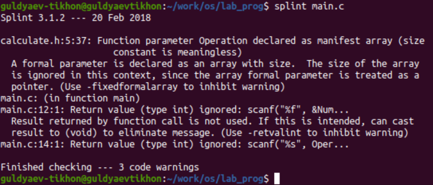{#fig:014 width=70%}

# Выводы

Я приобрел простейшие навыки разработки, анализа, тестирования и отладки приложений в ОС типа UNIX/Linux на примере создания на языке программирования С калькулятора с простейшими функциями.

# Ответы на контрольные вопросы

1. Как получить информацию о возможностях программ gcc, make, gdb и др.?

   Чтобы получить информацию о возможностях программ gcc, make, gdb и других утилит в UNIX, вы можете использовать следующие команды:

   - gcc --help - выведет информацию о доступных опциях компилятора gcc.
   - make --help - покажет справку по использованию утилиты make.
   - gdb --help - выведет информацию о командах и опциях отладчика gdb.

2. Назовите и дайте краткую характеристику основным этапам разработки приложений в UNIX.

   Основные этапы разработки приложений в UNIX:

   - Написание исходного кода на выбранном языке программирования.
   - Компиляция и сборка программы с использованием компилятора и утилиты make.
   - Запуск и отладка программы с помощью отладчика gdb.
   - Тестирование и исправление ошибок.
   - Развертывание и использование программы.

3. Что такое суффикс в контексте языка программирования? Приведите примеры использования.

   В контексте языка программирования суффикс - это часть имени файла, которая указывает на его тип или назначение. Например, в имени файла program.cc суффикс .cc указывает на то, что это файл с исходным кодом на языке программирования C++.

4. Каково основное назначение компилятора языка С в UNIX?

   Основное назначение компилятора языка C в UNIX - это преобразование исходного кода на языке C в машинный код, который может быть исполнен компьютером. Компилятор выполняет проверку синтаксиса и семантики программы, а затем создает исполняемый файл.

5. Для чего предназначена утилита make?

   Утилита make предназначена для автоматизации процесса компиляции программного проекта. Она позволяет определить зависимости между файлами и указать правила для их компиляции. make проверяет, какие файлы были изменены, и компилирует только необходимые файлы для создания исполняемого файла или библиотеки.

6. Приведите пример структуры Makefile. Дайте характеристику основным элементам этого файла.

       target: dependencies
           command1
           command2
           ...

   - target - цель, которую нужно построить (например, имя исполняемого файла).
   - dependencies - зависимости, файлы, от которых зависит цель.
   - command1, command2, ... - команды, которые нужно выполнить для построения

7. Назовите основное свойство, присущее всем программам отладки. Что необходимо сделать, чтобы его можно было использовать?

   Основное свойство, присущее всем программам отладки, - это возможность просмотра и изменения состояния программы во время выполнения. Чтобы использовать отладчик, необходимо компилировать программу с опцией -g, чтобы включить отладочную информацию в исполняемый файл.

8. Назовите и дайте основную характеристику основным командам отладчика gdb.

   Основные команды отладчика gdb:

   - run - запустить программу или перезапустить её после остановки.
   - break - установить точку останова на указанной строке кода.
   - step - выполнить следующую строку кода и остановиться.
   - print - вывести значение переменной или выражения.
   - continue - продолжить выполнение программы до следующей точки останова.
   - quit - выйти из отладчика gdb.

9. Опишите по шагам схему отладки программы, которую Вы использовали при выполнении лабораторной работы.

   - Запуск gdb
   - Запуск  программы run
   - Просмотр исходного кода командой list
   - Установка точки останова на нужной строке
   - Запуск програмы  run
   - Нахождение и исправление ошибки
   - Повторение процесса отладки

10. Прокомментируйте реакцию компилятора на синтаксические ошибки в программе при его первом запуске.
   При первом запуске компилятор обычно проверяет синтаксис программы и выдает сообщения об ошибках, таких как пропущенные точки с запятой, неправильное использование ключевых слов или несоответствие типов данных. Компилятор указывает на строки, содержащие ошибки, и предоставляет информацию о характере ошибок, чтобы помочь в их исправлении.

11. Назовите основные средства, повышающие понимание исходного кода программы.

    Основные средства, повышающие понимание исходного кода программы:

    - Комментарии в коде, которые поясняют назначение и логику работы различных частей программы.
    - Описательные имена переменных, функций и классов, которые отражают их назначение и функциональность.
    - Структурирование кода с использованием отступов и блоков, чтобы легче читать и понимать его структуру.
    - Документация и руководства пользователя, которые описывают функциональность и использование программы.

12. Каковы основные задачи, решаемые программой splint?
    Программа splint предназначена для статического анализа и проверки исходного кода на наличие ошибок, несоответствий и потенциальных проблем. Она обнаруживает проблемы, связанные с типами данных, потенциальными ошибками в памяти, неиспользуемыми переменными и другими подобными проблемами. splint помогает улучшить качество и безопасность программного кода.

# Список литературы{.unnumbered}

::: {#refs}

https://www.google.ru

https://chat.openai.com/chat

:::

